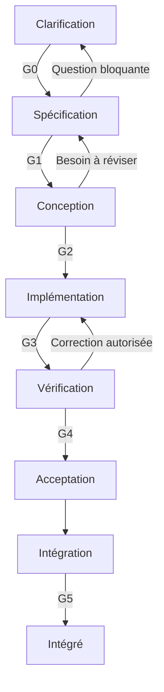

# 495 — conception du harnais de développement

Version : 0.1 — proposition de conception, 5 septembre 2026.

Ce document définit une nouvelle base pour 495. Il décrit les contrats à implémenter ; il ne prétend ni décrire une implémentation existante, ni apporter une preuve expérimentale de fiabilité. Les choix présentés sont les décisions proposées pour cette refonte.

## 1. Objectif et périmètre

495 accompagne un humain et des IA dans le développement d’une application, par incréments : clarification, spécification, conception, implémentation et intégration. Il prépare le travail, organise le feedback, vérifie les obligations et conserve la justification des transitions.

Le produit se compose de quatre éléments :

| Élément | Responsabilité | Interface principale |
| --- | --- | --- |
| Workflow par incrément | Déterminer le travail actuellement permis et les livrables attendus | Commandes, événements et définition de workflow |
| Artefacts versionnés | Exprimer le besoin, les décisions, les tâches et leurs dépendances | Références immuables et liens typés |
| Noyau embarqué | Vérifier les observations et autoriser les transitions | Évaluation pure d’une gate puis application atomique |
| Protocole d’adaptateurs | Accéder aux agents et environnements techniques | Opérations asynchrones versionnées, capacités déclarées |

La technologie interne retenue ici est Python. Aucun langage, framework de test, gestionnaire de paquets ou système de build n’est imposé à l’application cible. Un incrément peut toucher plusieurs composants écrits dans plusieurs langages.

La distribution de 495 embarque son runtime et ses bibliothèques pour chaque plateforme supportée. Le noyau n’exige ni serveur de politiques, ni moteur de conteneurs, ni CLI supplémentaire installé manuellement. Les agents et toolchains s’exécutent dans un environnement disposant des capacités demandées : environnement local existant ou worker distant. Si aucune capacité compatible n’est disponible, la préparation échoue explicitement avant de lancer un agent.

La première version vise un utilisateur et un contrôleur actif par projet. La publication collaborative, les signatures multi-acteurs et les exécutions distribuées concurrentes sont des extensions. L’authentification d’un utilisateur local n’est pas présentée comme une preuve d’identité opposable à un tiers.

## 2. Invariants du système

| ID | Invariant |
| --- | --- |
| INV-01 | Seul le contrôleur applique une transition ; ni un agent ni un adaptateur ne peut accepter un résultat. |
| INV-02 | Une décision désigne exactement ses entrées, sa politique, son ensemble de contrôles et ses preuves. |
| INV-03 | L’absence de preuve, un résultat mal formé ou un contrôle obligatoire non exécuté ne valent jamais réussite. |
| INV-04 | Un jugement favorable de modèle ne neutralise jamais une violation déterministe obligatoire. |
| INV-05 | Un artefact scellé est immuable ; toute modification crée une nouvelle révision. |
| INV-06 | La validité d’une preuve dépend des digests de ses entrées, pas seulement de son ancien statut « réussi ». |
| INV-07 | Le candidat accepté est le candidat vérifié. Une transformation ultérieure exige une nouvelle vérification appropriée. |
| INV-08 | L’agent ne dispose pas des droits de modification du journal, des politiques actives, des approbations ou des vérificateurs faisant autorité. |
| INV-09 | Un arrêt ambigu d’une opération reste ambigu jusqu’à réconciliation ; il n’est jamais converti en succès. |
| INV-10 | Chaque nouvelle tentative conserve les précédentes et applique les limites fixées dans son contrat. |
| INV-11 | Les scénarios publics sont distingués des contrôles privés et des informations autorisées dans le feedback. |
| INV-12 | Une gate structurelle ne prétend pas prouver la pertinence métier ou la qualité sémantique d’un document. |

Le modèle de menace considère le code et les sorties de l’agent comme non fiables. Le contrôleur, son magasin d’objets, la configuration de confiance et les workers autorisés appartiennent au périmètre de confiance. Un administrateur du poste capable de modifier ces composants reste hors de la garantie locale. Le niveau d’isolation est enregistré dans chaque exécution.

## 3. Workflow par incrément

### 3.1 Unité de travail

Un `Increment` représente un changement de valeur limité : objectif, périmètre, critères d’acceptation et composants concernés. Il peut être une fonctionnalité, une correction, une évolution technique ou une exploration.

Chaque incrément possède des `Revision` successives. Une révision contient les versions exactes de ses spécifications, décisions et tâches. Une `Attempt` est une tentative d’agent liée à un contrat scellé ; une tentative ne change pas de contrat en cours de route.

Une exploration produit des connaissances et des décisions. Elle peut être clôturée sans code, mais son statut ne vaut pas livraison d’une fonctionnalité. Le profil de workflow choisi au départ détermine ses livrables obligatoires ; l’agent ne peut pas passer au profil « exploration » pour contourner une gate.

### 3.2 Méthodes retenues

| Moment | Méthode | Usage de l’IA | Autorité humaine |
| --- | --- | --- | --- |
| Clarification | Example Mapping : règles, exemples, questions | Proposer des cas limites, reformuler les ambiguïtés | Choisir le besoin et résoudre les questions bloquantes |
| Spécification | BDD, Gherkin lorsque pertinent, exigences identifiées | Rédiger des comportements et détecter des contradictions | Valider l’intention et le périmètre |
| Conception | ADR, contrats d’interface, architecture évolutive | Comparer des options et proposer une stratégie de vérification | Arbitrer les décisions significatives |
| Implémentation | Petites tâches, TDD lorsque pertinent, tests de propriétés | Produire un candidat et exploiter les contrôles de progression | Intervenir selon la politique enregistrée |
| Intégration | Vérification de l’ensemble et mise à jour de la connaissance | Résumer les changements, preuves et limites | Approuver si le profil l’exige |

L’Agilité s’exprime par la taille des incréments et la possibilité de réviser le besoin. Elle ne suppose pas l’automatisation de cérémonies Scrum. Les rôles de découverte, formulation et revue peuvent être joués par une même personne ; trois agents ne remplacent pas trois sources indépendantes de jugement.

### 3.3 États

La phase est un enum : `clarifying`, `specifying`, `designing`, `implementing`, `verifying`, `accepted`, `integrating`, `integrated`, `closed`.

Le statut opérationnel est distinct : `idle`, `running`, `blocked`, `paused`, `reconciling`. « Bloqué » n’efface donc pas la phase à laquelle l’incrément se trouve.



Les flèches de retour ne modifient pas les artefacts scellés. Un retour avant G2 crée une nouvelle révision de travail. Après G2, une modification du contrat termine ou suspend la tentative courante et ouvre une nouvelle révision. Un incrément intégré n’est pas rouvert : son évolution passe par un nouvel incrément.

### 3.4 Commandes du domaine

| Commande | Précondition | Effet |
| --- | --- | --- |
| `CreateIncrement` | Projet et profil connus | Crée la première révision en clarification |
| `ProposeArtifact` | Révision ouverte, type autorisé dans cette phase | Enregistre une proposition ; aucune approbation implicite |
| `SealArtifact` | Format valide, dépendances résolues | Fige une révision d’artefact |
| `RecordApproval` | Acteur autorisé, cible exacte | Enregistre une approbation sur un digest et un périmètre |
| `EvaluateGate` | Entrées disponibles | Produit un rapport sans changer la phase |
| `ApplyGateDecision` | Rapport encore courant, version d’état attendue | Applique la transition et journalise atomiquement |
| `StartAttempt` | Contrat de phase scellé, gate d’entrée satisfaite si applicable, budget disponible ; G2 exigée pour écrire le code | Crée une opération d’agent idempotente |
| `SubmitCandidate` | Tentative connue | Capture un candidat immuable et prépare G3 |
| `ReviseIncrement` | Incrément non intégré/non clos | Crée une révision et recalcule les obligations obsolètes |
| `CancelOperation` | Opération en cours | Demande l’arrêt ; n’en présume pas la réussite |
| `CloseIncrement` | Aucun effet externe non réconcilié | Clôture avec motif, sans effacer les tentatives |

Un refus de gate peut être corrigé ; il ne clôt pas automatiquement l’incrément. La clôture a un motif explicite : `abandoned`, `superseded`, `budget_exhausted`, `exploration_complete` ou `invalid_protocol`.

### 3.5 Gates et garanties

| Gate | Entrées exigées | Contrôles obligatoires du profil standard | Garantie et limite |
| --- | --- | --- | --- |
| G0 — besoin cadré | Proposition, périmètre, questions | Objectif présent, acteur métier identifié, questions bloquantes résolues ou explicitement exclues du périmètre | Le travail est cadré ; sa valeur économique n’est pas démontrée |
| G1 — spécification prête | Exigences, exemples, contraintes, approbation métier | Identifiants uniques, références valides, syntaxe Gherkin valide si utilisée, méthode de vérification prévue pour chaque exigence obligatoire, approbation du digest | Une spécification approuvée et vérifiable est disponible ; sa justesse ne découle pas du parseur |
| G2 — contrat d’exécution prêt | G1, conception, tâches, plan de contrôles, base source, capacités | Exigences allouées, décisions significatives approuvées, contrôles qualifiés, environnement compatible, baseline enregistrée, budget et droits fixés | Le contrat est scellé avant actuation ; aucun résultat futur n’est promis |
| G3 — candidat recevable | Contrat, candidat, observation de fin d’agent | Capture complète, périmètre respecté, aucune écriture interdite, pas de processus auteur actif sur le snapshot, liens de preuve intègres | Le candidat est évaluable ; il n’est pas encore correct |
| G4 — candidat accepté | Candidat, résultats autorisés, approbations requises | Toutes les obligations satisfaites, aucun résultat manquant/obsolète, isolation suffisante, couverture des exigences obligatoire, baseline compatible | Les critères de cette politique sont satisfaits sur ce candidat précis |
| G5 — intégré | Acceptation G4, état de destination, reçu d’intégration | Destination attendue, contenu intégré égal au candidat accepté, mise à jour cohérente des références de spécification | L’état intégré correspond au candidat accepté |

La « couverture » documentaire signifie qu’une exigence possède une vérification déclarée et une preuve correspondante. Elle ne prouve pas que cette vérification est suffisante. Une revue du plan de contrôle est donc distincte de sa validation structurelle.

Les listes de contrôles attendus sont calculées à partir du contrat scellé, jamais à partir de la liste des résultats retournés. Une liste vide n’autorise pas G4 lorsque des obligations sont attendues.

### 3.6 Baseline et exceptions

Le profil standard exige que les contrôles de non-régression obligatoires réussissent sur la base. Un défaut préexistant peut être toléré uniquement par une exception approuvée avant actuation, avec identifiant de contrôle, signature du défaut, portée et justification. Une erreur d’infrastructure n’est pas une baseline acceptable. Une exception ne couvre pas un nouvel échec simplement parce que son nombre est identique.

Le contrôle du comportement à ajouter peut, lui, échouer sur la base : c’est un témoin utile. Un test de correction de bug doit si possible rejeter la base défectueuse et accepter une référence valide. Pour une fonctionnalité sans référence complète, documenter la qualification possible et sa limite ; ne pas inventer une preuve.

Les obligations techniques dures ne possèdent pas de bouton « forcer le succès ». Changer une obligation nécessite une nouvelle politique ou révision, avec l’historique et les approbations correspondantes. Une intervention d’urgence extérieure au harnais ne reçoit pas le statut G4.

### 3.7 L’IA intervient aussi avant l’implémentation

Une tentative d’IA existe dans chaque phase. Le contrôleur scelle un contrat de phase avant de la lancer : objectif de l’opération, entrées disponibles, types de sorties autorisés, droits, profil d’agent et limites. G2 scelle le contrat d’implémentation complet ; il n’est pas nécessaire pour demander à l’IA de clarifier un besoin ou de proposer une conception.

| Phase de l’agent | Gate d’entrée | Entrées | Écritures autorisées |
| --- | --- | --- | --- |
| Clarification | Aucune ; incrément et brief initial enregistrés | Demande humaine et contexte public sélectionné | Propositions, exemples, questions |
| Spécification | G0 | Proposition cadrée et contexte métier | Brouillons d’exigences et scénarios |
| Conception | G1 | Spécification approuvée et sources consultables | Brouillons de conception, contrats, ADR et plan de tâches |
| Implémentation | G2 | Contrat complet et contexte public | Candidat dans le périmètre déclaré |
| Revue | Contrat de revue avec entrées scellées | Artefacts ou candidat explicitement sélectionnés | Rapport de revue uniquement |

Les contrats de phase précoces vérifient l’intégrité, le périmètre et la forme des livrables ; ils ne supposent pas l’existence de tests exécutables d’un code encore non conçu. Les propositions produites sont capturées comme nouvelles révisions, puis évaluées par la gate de sortie correspondante.

Une phase de conception nécessitant une expérience de code ouvre une exploration explicitement autorisée dans un workspace jetable. Ce code n’est pas intégré par la gate documentaire. La synthèse de l’expérience référence ses observations ; une implémentation livrable repasse par G2–G5.

Les droits s’appliquent dans le worker, pas seulement dans le prompt. Le contrat de contexte enregistre la liste et les digests des documents envoyés, leur ordre et les éventuelles troncatures. Un document nécessaire qui dépasse le budget de contexte doit être découpé ou résumé dans un artefact identifiable ; il n’est pas omis silencieusement. Les sorties LLM respectant un schéma restent des propositions, jamais des faits approuvés.

## 4. Artefacts versionnés

### 4.1 Deux espaces distincts

L’espace du projet contient la connaissance publique et les brouillons de travail. Un magasin contrôlé par 495 contient les snapshots scellés, contrôles privés, preuves, approbations et événements. Ce magasin ne doit pas être un répertoire simplement caché dans le workspace accessible à l’agent.

| Chemin logique public | Contenu |
| --- | --- |
| `495/project.json` | Identité du projet et références de configuration, sans secrets |
| `495/specs/` | Vues des exigences actuellement intégrées |
| `495/decisions/` | ADR approuvés et remplacés |
| `495/changes/INC-0042/proposal.md` | Objectif, périmètre et hors-périmètre |
| `495/changes/INC-0042/requirements.json` | Exigences structurées et liens |
| `495/changes/INC-0042/features/` | Scénarios Gherkin métier |
| `495/changes/INC-0042/design.md` | Conception de l’incrément |
| `495/changes/INC-0042/contracts/` | Contrats d’interface selon la cible |
| `495/changes/INC-0042/tasks.json` | Tâches et dépendances |

Ces chemins sont des conventions exportables ; la sécurité ne repose pas sur eux. L’agent peut proposer des modifications dans son workspace, mais leur présence dans un fichier public ne les rend pas actives. La configuration exécutoire est une copie approuvée conservée par le contrôleur.

### 4.2 Types d’artefacts

| Type | Contenu minimum | Responsable de validation |
| --- | --- | --- |
| `proposal` | Objectif, périmètre, exclusions, questions | Responsable métier |
| `requirement_set` | ID, formulation, priorité, critères, méthode de vérification | Métier et contrôleur structurel |
| `scenario_set` | Scénarios identifiés et liens vers exigences | Métier ; runner pour exécution |
| `design` | Composants touchés, interfaces, risques, stratégie de test | Responsable technique |
| `decision` | Contexte, options, décision, conséquences | Responsable technique |
| `interface_contract` | Description formelle ou convention documentée | Adaptateur de validation approprié |
| `task_plan` | Tâches bornées, dépendances, exigences servies | Contrôleur et revue technique |
| `check_plan` | Contrôles, visibilité, qualification, autorité, limites | Autorité de contrôle |
| `execution_contract` | Snapshot de toutes les entrées exécutoires | Contrôleur |
| `candidate` | Manifeste du contenu source proposé | Contrôleur via worker autorisé |
| `observation` | Résultat d’une opération ou d’un contrôle | Adaptateur identifié, puis validation interne |
| `approval` | Acteur, rôle, cible, portée, décision | Canal d’approbation du contrôleur |
| `gate_decision` | Verdict, raisons, entrées et preuves | Noyau |

### 4.3 Identité et immutabilité

Chaque artefact a un identifiant logique stable, une révision monotone par identifiant, un type et une version de schéma. Le contenu est stocké par SHA-256 de ses octets exacts. Un manifeste décrit les fichiers : chemin relatif, digest, taille, mode et type. La première version refuse liens symboliques, chemins sortant du périmètre et collisions de casse non portables.

Le manifeste est lui-même stocké comme objet immuable. Les empreintes portent sur les octets effectivement stockés : aucun reformatage JSON ou changement de fins de ligne n’est permis après calcul. Le producteur utilise un sérialiseur déterministe ; le vérificateur contrôle les octets reçus sans les re-sérialiser pour recalculer leur identité. Une future signature portable ajoutera une convention de sérialisation spécifiée séparément.

Une référence contient `artifact_id`, `revision`, `kind`, `schema_version` et `digest`. La révision sert à l’humain ; le digest assure la liaison exacte. Une référence `latest` est interdite dans un contrat scellé.

Git sert à la collaboration et à l’intégration, pas à cacher les capteurs. La base doit être un état propre ou un snapshot explicite incluant les fichiers non suivis autorisés. Un nom de branche ne suffit pas à identifier une base. Les sous-modules ou grands fichiers externes non pris en charge bloquent la préparation au lieu d’être ignorés.

### 4.4 Liens et invalidation

Les liens exécutoires sont typés : `depends_on`, `verifies`, `implements`, `approves`, `supersedes`. Les liens `related_to` sont informatifs et n’entraînent pas d’invalidation. Le graphe `depends_on` est acyclique ; les autres relations ne sont pas assimilées à un graphe d’ordonnancement.

Une approbation valide un digest, jamais un chemin. Une nouvelle révision n’efface pas l’ancienne approbation : elle ne peut simplement pas l’utiliser. Même règle pour les preuves.

| Changement | Effet minimal |
| --- | --- |
| Exigence ou scénario obligatoire | Réévaluer G1 et tous ses dépendants |
| Décision ou contrat d’interface | Réévaluer G2 et les contrôles concernés |
| Politique, vérificateur, environnement ou base | Nouveau contrat, baseline à réévaluer, nouvelle tentative si actuation nécessaire |
| Code candidat | Réévaluer G3/G4 sur le nouveau candidat |
| Branche de destination avancée | Bloquer l’intégration ; rebaser dans une nouvelle préparation |
| Note informative non consommée | Aucun effet sur les preuves exécutoires |

La règle conservatrice initiale est de réexécuter tous les contrôles obligatoires de G4 sur tout nouveau candidat. La réutilisation sélective de résultats viendra après démonstration de l’exhaustivité des dépendances déclarées.

### 4.5 Inspiration Spec Kit et OpenSpec

Reprendre la séparation besoin/spécification/plan/tâches de Spec Kit et le dossier de changement avec proposition, conception et évolution des spécifications d’OpenSpec. 495 conserve ses propres identités et règles de validation. Il ne prétend pas à une compatibilité de format complète.

Les ressources éventuellement reprises sont embarquées à une version précise, accompagnées de leur origine et licence. Aucun appel de leurs CLI n’est nécessaire. Les templates initiaux peuvent être écrits pour 495 en s’appuyant sur ces conventions, puis comparés aux ressources amont avant toute reprise de code.

## 5. Noyau embarqué de validation et de décision

### 5.1 Architecture interne

| Module | Responsabilité | Interdiction |
| --- | --- | --- |
| `domain` | Références, états, obligations, décisions | Aucun accès réseau, filesystem ou SDK d’agent |
| `validation` | Schémas, liens, structure, cohérence des preuves | Ne lance pas les toolchains cibles |
| `policy` | Réduction déterministe des faits en verdict | Pas d’appel LLM, commande shell ou expression arbitraire |
| `application` | Cas d’usage, budgets, orchestration, reprise | Ne contourne pas le noyau |
| `ports` | Interfaces de stockage, exécution, agents et approbation | Aucun couplage à Java, Node, Python cible, etc. |
| `infrastructure` | Journal, objets, transports et adaptateurs | Ne crée pas un verdict d’acceptation |

Les plugins embarqués de validation s’exécutent dans le périmètre de confiance et sont livrés avec 495. Le code fourni par l’application cible n’est jamais importé comme plugin Python du contrôleur.

### 5.2 Interface de décision

Signature conceptuelle : `evaluate_gate(state, gate, contract, observations, approvals) -> GateDecision`.

La fonction est pure : mêmes entrées, même décision. L’heure, les budgets consommés et les expirations éventuelles arrivent sous forme de faits explicites. L’application de la décision est une opération séparée avec contrôle de concurrence.

`GateDecision` contient : identifiant, gate, version du moteur, digest de politique, empreinte du bundle d’entrée, `expected_state_version`, candidat éventuel, verdict et liste de raisons structurées. Chaque raison référence l’obligation et les preuves qui la justifient ; une raison manquante de type `MISSING_EVIDENCE` désigne le contrôle attendu.

Verdicts :

| Verdict | Sens | Transition |
| --- | --- | --- |
| `PASS` | Toutes les obligations sont satisfaites | Autorisée sous préconditions inchangées |
| `FAIL` | Une obligation est violée | Interdite ; correction possible |
| `INDETERMINATE` | Données insuffisantes, périmées ou inexploitées | Interdite ; diagnostic/reprise |

Une approbation humaine attendue produit `INDETERMINATE` avec raison `APPROVAL_REQUIRED`. Un refus explicite produit `FAIL`. Les conseils non bloquants sont enregistrés séparément et n’affectent pas le verdict.

Ordre d’évaluation : vérifier l’intégrité et la provenance admissible ; établir les observations utilisables ; constater les violations valides ; identifier les obligations non résolues ; autoriser seulement si toutes sont satisfaites. Une sortie mal formée qui dit « échec » n’est pas une violation démontrée ; elle rend l’observation inutilisable. Une vraie violation connue et une preuve manquante donnent `FAIL`, avec les deux raisons conservées.

### 5.3 Politique déclarative bornée

La première version utilise JSON validé, avec uniquement des opérateurs prédéfinis : `all_of`, `any_of`, `check_passed`, `approval_present`, `artifact_present`, `digest_matches`, `capability_satisfied`, `within_budget`. Pas de code exécutable, d’`eval`, d’expression Python ou de DSL généraliste.

`any_of` sert à des alternatives légitimes approuvées, par exemple deux modes d’exécution équivalents. Une obligation déterministe dure ne peut pas figurer dans une alternative avec un avis de modèle. Le validateur de politique rejette ce montage. Chaque gate doit comporter les obligations minimales imposées par son profil.

Une politique est sélectionnée et approuvée avant actuation. Les changements proposés par l’agent sont des artefacts ordinaires non exécutoires.

### 5.4 Contrôles déterministes et jugement

Chaque contrôle déclare sa méthode : `structural`, `executable` ou `judgment`. Les contrôles exécutables peuvent être instables malgré leur intention déterministe : les répétitions autorisées et la règle d’agrégation sont fixées à l’avance. Les échecs observés ne sont pas supprimés jusqu’à obtenir du vert.

Le profil initial permet au modèle de produire des revues et diagnostics, mais réserve les obligations qualitatives bloquantes à une approbation humaine. Des profils futurs pourront qualifier un jugement de modèle comme preuve d’une obligation qualitative précise ; il ne deviendra pas une autorité générale.

Un rapport doit indiquer explicitement la nature de chaque preuve. « Vérifié » signifie toujours « selon ces contrôles et ce périmètre ».

### 5.5 Journal, transactions et reprise

Le journal append-only est la source de vérité métier ; SQLite est une projection reconstructible. Un seul écrivain détient le verrou du projet. Les événements ont un numéro de séquence et un lien vers le digest précédent. Chaque événement est un enregistrement JSONL complet ; son hash est calculé sur une représentation déterministe du payload comprenant `previous_hash`, puis stocké dans l’enveloppe.

Avant d’enregistrer un événement référençant un objet, écrire cet objet dans un fichier temporaire, synchroniser et renommer atomiquement dans le magasin. Les décisions sont ajoutées au journal et synchronisées avant de mettre à jour la projection. Une panne de projection se répare par rejeu. Une fin de fichier partiellement écrite est mise en quarantaine ; une corruption au milieu du journal bloque la reprise automatique.

Chaque commande porte `command_id` et `expected_state_version`. Le contrôleur vérifie ces champs sous verrou. Un même identifiant avec le même payload retourne le résultat précédent ; le même identifiant avec un payload différent est rejeté.

Les effets externes suivent : événement d’intention durable → envoi idempotent → observation durable. Si le contrôleur s’arrête entre l’effet externe et son enregistrement, il demande le statut de l’opération existante. Il ne relance pas aveuglément l’agent ou l’intégration.

Le record chaîné détecte les incohérences relativement à une tête de chaîne connue. Il ne résiste pas à un administrateur réécrivant tout l’historique et cette tête. Une extension pourra signer/exporter des points de contrôle ; la première version expose honnêtement cette limite.

## 6. Protocole d’adaptateurs indépendant des cibles

### 6.1 Quatre ports

| Port | Fonction |
| --- | --- |
| `AgentPort` | Lancer, observer et arrêter une production ou revue par IA |
| `ExecutionPort` | Préparer un workspace, exécuter un contrôle approuvé, capturer un candidat |
| `RepositoryPort` | Lire la base et intégrer un candidat par comparaison atomique de la destination |
| `ApprovalPort` | Recueillir une décision humaine sur des références exactes |

Les résultats de tous les ports passent par le même validateur d’enveloppe. Leurs opérations sont distinctes : un agent ne reçoit jamais un jeton autorisant une opération du port d’approbation ou d’intégration.

### 6.2 Contrat et transports

Le protocole CSAP 1.0 est un protocole applicatif proposé ici, pas un standard existant. Il définit des enveloppes JSON et une sémantique commune. Le transport initial peut être en processus pour un adaptateur livré et approuvé, ou via un processus enfant livré avec 495, avec messages NDJSON sur stdin/stdout et diagnostics sur stderr. Les workers distants utiliseront le même contrat sur une connexion authentifiée et chiffrée.

Le versionnement majeur change lors d’une rupture. La négociation choisit une version commune ; sinon la préparation est refusée. Les ajouts mineurs restent optionnels. Les champs inconnus sont refusés, sauf dans un objet `extensions` à noms qualifiés ; une extension obligatoire non comprise bloque l’opération.

Le handshake `describe` retourne : identité et version de l’adaptateur, versions de protocole, opérations supportées, plateformes, toolchains disponibles, limites et capacités d’isolation. Ces déclarations sont comparées à un profil de confiance configuré par l’opérateur. Un adaptateur ne se rend pas fiable en affirmant lui-même qu’il l’est.

### 6.3 Opérations

| Opération | Entrées | Sortie |
| --- | --- | --- |
| `describe` | Versions supportées du client | Capacités et identité |
| `prepare` | Base, contrat, droits et ressources | Handle opaque de workspace, environnement résolu |
| `start_agent` | Handle, profil explicite, contexte public, limites | Identifiant d’opération |
| `capture_candidate` | Handle, périmètre de capture | Manifeste immuable et observations de périmètre |
| `run_check` | Candidat, référence du contrôle approuvé, limites | Identifiant d’opération |
| `get_operation` | Identifiant d’opération et curseur | État, événements et résultat terminal éventuel |
| `cancel_operation` | Identifiant, motif | Accusé de demande, pas garantie d’arrêt |
| `release` | Handle | Confirmation de nettoyage ou erreur explicite |
| `integrate` | Candidat accepté et destination attendue | Reçu d’intégration ou conflit |

Les opérations longues ne gardent pas une requête bloquée. Elles exposent `queued`, `running`, `succeeded`, `failed`, `cancelled`, `unknown`. Le `succeeded` d’une opération de test signifie que l’exécution a produit un résultat exploitable ; ce résultat peut être `FAIL`.

### 6.4 Enveloppes proposées

Exemple illustratif : les chaînes `sha256:<...>` sont des emplacements à remplacer par de vrais digests avant validation.

```json
{
  "protocol_version": "1.0",
  "request_id": "REQ-42",
  "idempotency_key": "OP-42-CHECK-acceptance",
  "operation": "run_check",
  "increment_id": "INC-0042",
  "attempt_id": "ATT-0002",
  "contract_ref": "sha256:<contract>",
  "payload": {
    "candidate_ref": "sha256:<candidate-manifest>",
    "check_ref": "sha256:<approved-check>",
    "workspace_handle": "ws-verifier-42",
    "limits": {"wall_time_seconds": 120, "output_bytes": 1048576}
  },
  "extensions": {}
}
```

Résultat terminal d’un contrôle :

```json
{
  "protocol_version": "1.0",
  "request_id": "REQ-42",
  "operation_id": "OP-42-CHECK-acceptance",
  "operation_status": "succeeded",
  "result": {
    "check_id": "acceptance",
    "check_ref": "sha256:<approved-check>",
    "contract_ref": "sha256:<contract>",
    "candidate_ref": "sha256:<candidate-manifest>",
    "environment_ref": "sha256:<resolved-environment>",
    "outcome": "FAIL",
    "requirements": [{"id": "REQ-17", "outcome": "FAIL"}],
    "process": {"exit_code": 1, "timed_out": false},
    "evidence_refs": ["sha256:<test-report>"],
    "feedback_ref": "sha256:<sanitized-feedback>"
  },
  "error": null
}
```

Les statuts de contrôle sont `PASS`, `FAIL`, `ERROR`, `NOT_RUN`. Un contrôle optionnel non applicable est exclu du plan avant exécution ; il ne doit pas disparaître a posteriori. Un résultat `PASS` sans toutes les observations requises par le schéma du contrôle est inutilisable.

Le résultat est lié au producteur par le canal authentifié ou le processus lancé et supervisé par 495. Les champs déclaratifs ne remplacent pas cette liaison. Les objets sont transférés par références opaques dans un magasin autorisé : pas de téléchargement arbitraire d’URL donnée par l’agent. Taille, digest et chemins sont vérifiés avant import.

### 6.5 Configuration des commandes cibles

Un contrôle exécutable référence un manifeste approuvé contenant : `argv` sous forme de liste, répertoire de travail borné, variables d’environnement autorisées, références opaques de secrets, timeout, parseur de sortie, résultats attendus et dépendances de vérification.

Le protocole n’impose pas Maven, pytest ou npm. Exemples d’implémentations de capacités : un composant Java utilise son build Java ; un composant TypeScript son runner ; une API peut être vérifiée extérieurement quelle que soit sa technologie.

Pas de shell implicite ni de concaténation d’une commande depuis le texte libre de l’agent. Un script du projet peut être exécuté comme code non fiable dans le workspace d’exécution ; il ne devient pas un vérificateur faisant autorité simplement parce qu’il imprime un rapport vert.

### 6.6 Profil d’agent

Le profil contient le backend, le modèle et les paramètres natifs explicitement choisis. 495 ne transforme pas silencieusement un effort non pris en charge en un autre. L’adaptateur retourne une erreur `UNSUPPORTED_PARAMETER` ou enregistre les paramètres effectivement appliqués.

L’interface n’impose ni routage dynamique ni mode rapide. Les différences des fournisseurs restent visibles. Un backend peut piloter un CLI déjà disponible ou un worker, un autre une API de modèle ; l’agent et son outillage doivent alors être fournis explicitement. Une API de complétion seule n’est pas assimilée à un agent de développement complet.

### 6.7 Erreurs et reprises

Codes communs : `UNSUPPORTED_VERSION`, `UNSUPPORTED_CAPABILITY`, `UNSUPPORTED_PARAMETER`, `INVALID_INPUT`, `AUTHORIZATION_DENIED`, `ENVIRONMENT_UNAVAILABLE`, `TIMEOUT`, `RESOURCE_LIMIT`, `OUTPUT_INVALID`, `INTEGRITY_MISMATCH`, `CONFLICT`, `OPERATION_UNKNOWN`.

L’adaptateur peut annoncer `retryable`, mais seul le contrôleur décide de la reprise. Une clé idempotente correspond à un payload exact ; les doublons renvoient la même opération. La durée de conservation des identifiants est annoncée. Après expiration ou `OPERATION_UNKNOWN`, une opération à effets externes n’est pas répétée sans réconciliation.

Une tentative supplémentaire de modèle consomme une nouvelle unité de budget ; une reconnexion à la même opération n’en crée pas une. Les reprises d’infrastructure ont un plafond séparé. Le contrat fixe délais, nombre de tentatives et règles d’arrêt ; le contrôle des coûts en monnaie n’est pas requis dans le premier périmètre.

### 6.8 Isolation et fidélité du feedback

Trois capacités indépendantes sont négociées : isolation du processus auteur, protection du magasin de contrôle, séparation du vérificateur. Un workspace dédié facilite le nettoyage mais ne prouve aucune des trois.

Le profil standard d’exécution de code non fiable exige un worker autorisé capable de protéger le contrôleur et le vérificateur. Si le poste ne dispose pas de ce worker, 495 utilise un worker distant configuré ou bloque. Il ne descend pas silencieusement au sous-processus local.

Le candidat est capturé après arrêt confirmé des processus auteurs, ou par un snapshot atomique que ces processus ne peuvent plus modifier. Le vérificateur démarre avec ses dépendances approuvées et seulement les entrées déclarées. Les caches et paramètres du candidat ne sont pas importés comme environnement du vérificateur.

Deux classes de contrôles : `progress` (feedback public autorisé) et `acceptance_private`. Les exigences sont publiques ; seuls les cas et moyens d’évaluation privés restent secrets. Le vérificateur n’ajoute pas de critères métier cachés.

Le feedback privé est produit par une projection à liste blanche de codes et catégories, jamais en relayant les logs bruts. Un résultat binaire répété reste une fuite d’information ; le contrat fixe donc le nombre de consultations privées. Pour une campagne expérimentale, un jeu final non consulté pendant l’itération est séparé des capteurs de progression. Les fichiers privés ne sont pas envoyés au backend d’agent, y compris via les pièces jointes, archives ou journaux.

## 7. Intégration et prévention des courses

L’intégration initiale est locale au dépôt configuré ; publier ou pousser est une opération distincte, non implicite.

Le candidat accepté contient l’ensemble des sources, tests publics et documents destinés au dépôt. Les documents intégrés ne sont pas régénérés après G4. Le reçu et les décisions sont externes au candidat afin d’éviter une dépendance circulaire entre son digest et son propre verdict.

`integrate` compare atomiquement la destination à la base attendue. Si elle a changé, il retourne `CONFLICT`. Une résolution de conflit ou un rebase produit un nouveau candidat et réévalue les gates dépendantes. Un commit peut avoir une nouvelle identité à cause de ses métadonnées ; la garantie G5 porte sur le contenu identifié et le parent attendu.

En cas de crash après mouvement de la destination mais avant réception du reçu, le contrôleur demande l’état de l’opération et compare la destination au candidat. Il ne crée pas un second commit aveuglément. La première version ne promet pas de transaction atomique sur plusieurs dépôts : un incrément exécutoire vise un dépôt, éventuellement polyglotte.

## 8. Parcours concret : ajouter une opération à une application polyglotte

Exemple fictif : ajouter un résumé des déploiements dans une application possédant un backend Java et une interface TypeScript.

1. `INC-0042` précise les données affichées, les utilisateurs autorisés et les exclusions. L’IA propose les cas « aucun déploiement », « environnement inconnu » et « utilisateur non autorisé ». Le responsable métier résout les questions : G0.
2. Les exigences `REQ-17` à `REQ-19` sont reliées à des scénarios publics. Une exigence de latence décrit charge, environnement de mesure et seuil ; elle n’est pas réduite à un scénario narratif ambigu. Le responsable approuve le bundle : G1.
3. La conception fixe le contrat HTTP, les composants touchés et une décision sur l’agrégation. Le plan alloue chaque exigence à des tâches et contrôles. Les adaptateurs confirment la disponibilité des toolchains Java et TypeScript sur le worker.
4. Les contrôles publics comprennent les tests du backend, du frontend et du contrat. Les contrôles privés correspondent aux mêmes exigences avec d’autres données. Le contrôleur enregistre qualification, baseline, versions, droits et budget de deux tentatives : G2.
5. L’agent reçoit les artefacts publics et son workspace. Le magasin privé n’est pas monté. La première proposition modifie uniquement les chemins autorisés ; elle devient `CAND-1` : G3.
6. Le contrôle public de l’état vide échoue. G4 retourne `FAIL`. Le contrôleur transmet le diagnostic public, conserve le candidat et autorise la deuxième tentative dans la limite fixée.
7. `CAND-2` satisfait les contrôles obligatoires et les approbations prévues. G4 accepte exactement ce manifeste. L’IA n’écrit jamais ce statut.
8. Si la destination n’a pas bougé, l’intégration applique `CAND-2` et G5 enregistre le reçu. Si elle a bougé, l’incrément reste accepté sur son ancienne base, mais bloqué pour intégration ; une nouvelle préparation est nécessaire.

Variante : si le métier change la règle d’agrégation à l’étape 6, le contrôleur crée une nouvelle révision. Il ne réutilise ni l’approbation de spécification ni le contrat précédent. Cette évolution est normale dans le workflow, mais distincte d’une correction sous contrat inchangé.

## 9. Critères de qualification de 495

Ces tests portent sur le harnais lui-même. Ils ne sont pas les tests imposés aux applications cibles.

| Cas | Résultat exigé |
| --- | --- |
| Un modèle déclare « terminé » sans preuves | Aucune acceptation |
| Un contrôle obligatoire manque dans les résultats | `INDETERMINATE` |
| Un scénario échoue mais le processus de runner réussit | G4 `FAIL` |
| Un candidat change après un résultat vert | Résultat non réutilisable |
| Une approbation vise une ancienne spécification | Approbation non applicable |
| Le contrat contient une alternative « test réussi ou avis LLM favorable » pour une obligation dure | Politique rejetée |
| Un adaptateur retourne une version, un digest ou un schéma invalide | Observation rejetée |
| L’adaptateur ne garantit pas l’isolation requise | G2 bloquée |
| L’agent écrit un faux rapport dans son workspace | Ce rapport ne remplace pas l’observation du vérificateur autorisé |
| Deux applications cibles de langages différents produisent les mêmes faits normalisés | Même décision du noyau |
| Le contrôleur s’arrête après lancement d’un agent | Reconnexion à l’opération, pas de double tentative |
| Le contrôleur s’arrête après intégration externe | Réconciliation avant tout nouvel effet |
| La branche avance après G4 | Intégration refusée sans revalidation |
| SQLite est supprimé | État reconstruit depuis journal et objets |
| Le journal est altéré ou un objet manque | Vérification échouée ; aucune poursuite silencieuse |
| Un diagnostic privé contient une valeur secrète | Projection de feedback ne la transmet pas |

Les séquences de transitions, interruptions et révisions se prêtent aux tests de propriétés. Un kit de conformité CSAP doit être exécuté pour chaque adaptateur : négociation, idempotence, erreurs, arrêt, reprise, liaison des entrées et limites. Un worker qui respecte la forme du protocole n’est pas automatiquement qualifié pour son niveau d’isolation ; cette qualification est séparée.

Mesures initiales : acceptations incorrectes dans un corpus de candidats connus, rejets de candidats valides, proportion d’indéterminations, temps de contrôle et nombre d’interventions. Pour comparer des boucles d’IA, pré-enregistrer les tâches, profils, budgets, répétitions et exclusions dans un artefact de campagne indépendant du workflow produit.

## 10. Ordre d’implémentation proposé

| Lot | Livrable | Critère de sortie |
| --- | --- | --- |
| A — domaine | Références, artefacts, obligations, phases, invalidation | Cas de transitions et d’obsolescence testés sans agent |
| B — décisions | Schémas, politiques bornées, rapports G0–G5, approbations | Décisions rejouables et refus des preuves manquantes |
| C — persistance | Magasin d’objets, journal, projection SQLite, reprise | Reconstruction et tests de crash aux frontières d’effets |
| D — protocole | CSAP 1.0, adaptateurs simulés et kit de conformité | Même workflow avec plusieurs cibles simulées |
| E — première exécution | Un worker qualifié, un backend d’agent et deux petites cibles de technologies différentes | Parcours complet et séparation du vérificateur constatée |
| F — méthodologie | Templates, analyse Gherkin, liens exigences/contrôles et ADR | Incrément complet depuis le besoin, pas uniquement depuis une tâche de coding |
| G — campagne | Corpus valide/invalide et comparaison des modes de feedback | Rapport incluant échecs et résultats non informatifs |

Les modèles d’artefacts de F sont esquissés dès A ; leur ergonomie est finalisée avec les premiers parcours. Le développement ne doit pas attendre F pour représenter spécification et conception.

Le noyau utilise en priorité la bibliothèque standard et un validateur JSON Schema embarqué. Le parseur Gherkin officiel est ajouté au support BDD. Une bibliothèque de machine à états est facultative ; aucun moteur de politiques externe n’est requis. La signature cryptographique est une extension avec bibliothèque embarquée lorsque le besoin d’échange de preuves le justifie. Chaque distribution fige et inventorie ses dépendances et leurs licences, sans téléchargement implicite de plugins à l’exécution.

## 11. Décisions et limites à conserver dans la conception détaillée

Décisions fixées dans cette proposition : contrôle indépendant de l’agent ; petits incréments ; snapshot avant actuation ; révision explicite ; preuves exactes ; politique locale bornée ; protocole polyglotte ; aucun service externe obligatoire pour le noyau ; environnement d’exécution interchangeable ; acceptation distincte de l’intégration.

Choix restant à trancher au début du lot E : plateformes de distribution prioritaires ; worker d’exécution local embarqué ou distant à livrer en premier ; backend d’agent initial. Ces choix n’affectent pas les contrats du domaine et ne justifient pas de repousser A–D.

Garanties non revendiquées : déterminisme du modèle ; exhaustivité sémantique des tests ; sandbox universel sans dépendances système ; identité humaine forte dans le mode local ; immunité à un administrateur du contrôleur ; atomicité multi-dépôts ; équivalence parfaite des environnements de production et de test.

## 12. Références de conception

Les références suivantes ont été examinées dans l’étude précédente. Elles motivent la réutilisation de formats et de méthodes ; la machine à états, CSAP et les garanties ci-dessus sont des propositions 495, pas des propriétés attribuées à ces projets.

- [GitHub Spec Kit](https://github.com/github/spec-kit) et [licence MIT](https://github.com/github/spec-kit/blob/main/LICENSE) : séparation des artefacts de spécification, plan et tâches.
- [OpenSpec](https://github.com/Fission-AI/OpenSpec) et [licence MIT](https://github.com/Fission-AI/OpenSpec/blob/main/LICENSE) : organisation du travail par proposition de changement et artefacts associés.
- [BDD — Cucumber](https://cucumber.io/docs/bdd/) : découverte, formulation et automatisation.
- [Gherkin officiel](https://github.com/cucumber/gherkin) : parseur réutilisable ; [step definitions](https://cucumber.io/docs/cucumber/step-definitions/) : liaison à l’exécution propre à la cible.
- [Cucumber Messages](https://github.com/cucumber/messages) : format d’échange de résultats BDD.
- [ADR](https://adr.github.io/) : décisions et justifications ; [OpenAPI](https://www.openapis.org/what-is-openapi) : contrats HTTP indépendants des langages.
- [jsonschema](https://github.com/python-jsonschema/jsonschema) : validation des contrats structurés, sans moteur externe.
- [Principes Agile](https://agilemanifesto.org/principles.html) : incréments et accueil des changements.
