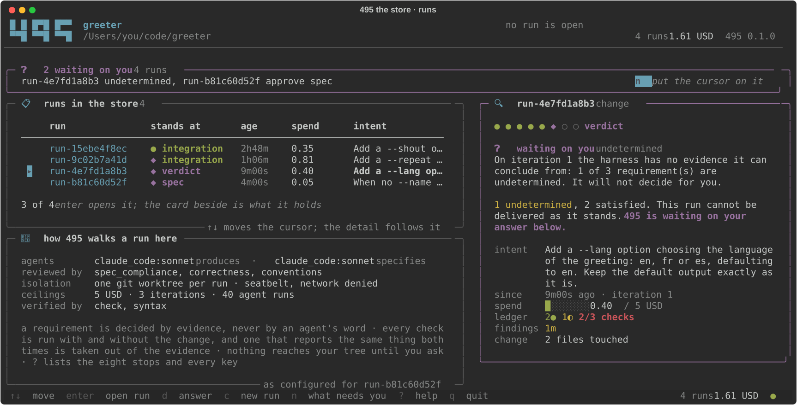
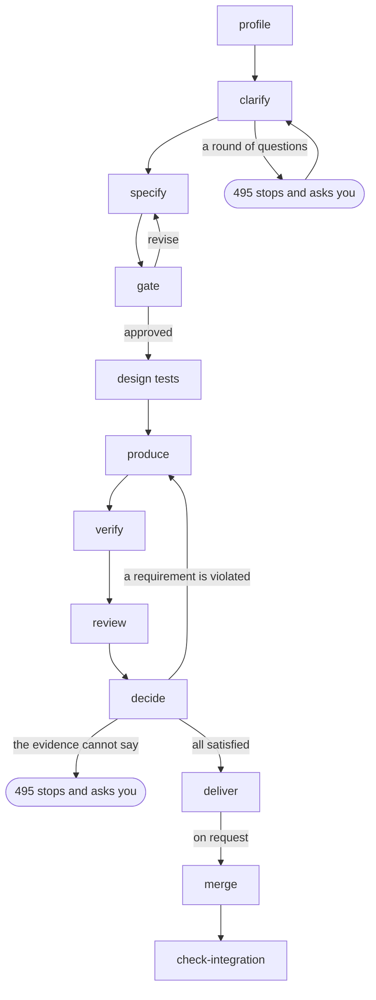

<p align="center">
   
</p>

<p align="center">
   <b>The agent harness that ensures quality</b><br>
</p>

<p align="center">

[](LICENSE)
[](https://www.python.org/)
[](https://www.anthropic.com/claude-code)
[](https://openai.com/codex/)
[](https://github.com/ollama/ollama)


</p>

**495 is an *agentic engineering harness*: a control plane that carries a software change from an intent to a
branch you can merge.** You write the request in prose; 495 has it specified, produced in
isolation, verified by your project's own commands and reviewed from independent perspectives,
then concludes on the evidence it collected — and hands you a patch, a branch and a report.

Every requirement, decision, intervention and piece of evidence is explicit and traceable. A
change is accepted only when the evidence supports it, never because the agent says it is done.
Nothing reaches your working tree until you ask for it, and what you merged is checked against
what was verified.

<p align="center">
   
</p>

<p align="center">
   <sub><a href="docs/assets/demo.mp4">▶ Watch as a video</a> — four minutes, pausable</sub>
</p>


## Why 495?

495 is the three-digit ***Kaprekar constant***: a fixed point reached by repeatedly
applying a simple, deterministic rule to many different starting states.
Explore the step-by-step process at [6174.co.uk/495](https://www.6174.co.uk/495).

The name reflects 495's purpose: apply explicit rules and feedback at every stage until a
software change is cleared to merge.


## Available

- [x] **A control plane for coding agents**: Claude Code, Codex and any local model behind an OpenAI-compatible API do the work; 495 owns the workflow, the evidence and the accept-or-reject decision
- [x] **Spec-driven development**: from a prose intent to requirements `R1..Rn`, each tied to the verifications `V1..Vm` that decide it
- [x] **Produced in isolation**: every run works in a git worktree of its own, on branch `495/<run-id>`, created outside the project; your working tree is never touched
- [x] **Verified by your project's own commands**: detected or declared, and proven executable on the base version before anything is produced
- [x] **Tests written before the change**: the tests the specification calls for are written by a test designer in an intervention of its own, on a tree where the behaviour does not exist, and the producer may not touch them
- [x] **Independent review**: one read-only agent per perspective, structured verdicts, no access to the producer's transcript
- [x] **Decided on evidence**: each requirement becomes `satisfied`, `violated` or `undetermined`; evidence that cannot conclude stops the run and asks you
- [x] **Feedback that names the gap, not the fix**: a correction request states which requirement is not demonstrated and what was observed
- [x] **Every check measured before it counts**: each one runs twice, on the change and on the base version carrying the change's own test files; one that reports the same thing both times proves nothing — whether it failed both times or passed both times — and is taken out of the evidence instead of becoming work
- [x] **The suite that passed stays passing**: the tests the base version passed are measured on the change; a test deleted, removed or skipped, or a smaller tally, is a failed check, and a passing command on such a suite credits nothing
- [x] **Measured against a catalogue of test libraries**: which tool the project measures each test role with, per technology; every gap is a proposal you answer once, and a retrospective states what the run showed about each tool that measured one
- [x] **A rich terminal UI**: eight stops in the order the engine walks them — where the run is, what each stage produced, and the controls that act on it
- [x] **Merge on request only**, in four shapes, followed by the integration check that inspects it
- [x] **Scoped permissions**: read-only roles and one write role, each under the isolation its client offers, with what was actually applied recorded per intervention
- [x] **Context engineering**: every prompt separates established facts from untrusted content
- [x] **Budgets and cost accounting**: cost is `reported`, `estimated` or `unknown`, never silently zero, and limits are enforced before each intervention
- [x] **Traceability**: one JSON document per run, an append-only event log, and every prompt, transcript, structured output and command output on disk
- [x] **Three interfaces over one engine**: a CLI (interactive or `--json`), a terminal UI, and an HTTP API
- [x] **Any target project**: 495 is written in Python, but only needs the commands your project declares

## Planned

Each item below is a gap 495 knows about — observed in its own behaviour, or in what has
actually been exercised. None of them is a dated commitment.

- [ ] **Docker isolation exercised against a live daemon**: the backend is unit-tested only
- [ ] **Correction iterations exercised with a live agent**: the loop is covered by test doubles and a fixed corpus
- [ ] **The merge over the HTTP API**: it can create, decide, resume, stop and check an integration, but not merge
- [ ] **The terminal UI on Windows**: it reads the keyboard through `termios`, and Seatbelt is macOS-only
- [ ] **Redaction of what leaves a run**: transcripts, command outputs and reports are written as captured
- [ ] **Exact context accounting for Codex**: only an upper bound is observable from its stream
- [ ] **A model catalogue**: any model string the client accepts is passed through, so an unknown one is only rejected by the client, and its cost is unknown rather than estimated


## Scope

- **Local only**: 495 works in a worktree of its own and never creates a remote branch, pushes, or alters a remote. The single command that writes to your checkout is `495 merge`, and only when you ask for it.
- **It does not replace human judgment**: when the evidence cannot decide, 495 stops, lays out the facts and hands the question back.
- **Independent of your toolchain**: 495 is written in Python; your project only has to declare the commands 495 must run.
- **One intent per run**: a run carries one intent to one branch, and keeps every attempt it made at it.


## Quick start

### Requirements

| Requirement | Purpose |
| --- | --- |
| macOS or Linux, Git, Python 3.11+ | Run 495. [uv](https://docs.astral.sh/uv/) is used when present; otherwise `venv` + `pip` |
| A Git repository with at least one commit | The base version every piece of evidence is measured against |
| At least one agent: [Claude Code](https://www.anthropic.com/claude-code) (`claude auth status`), [Codex](https://openai.com/codex/) (`codex login status`), or an OpenAI-compatible endpoint such as [Ollama](https://github.com/ollama/ollama) | The interventions. Only agent-driven commands need one |
| Optional: macOS Seatbelt (`sandbox-exec`, built in) or Docker | Isolation for local models and for the harness's own commands |

Tested on macOS. Linux is expected to work; Windows is not supported by the terminal UI.

### Install

```sh
git clone https://github.com/jeanjerome/495.git
cd 495
./run.sh --version
```

`run.sh` creates `.venv` on first use, installs the package, and hands every argument to the
CLI. The same CLI is installed as `495`; the examples below use `./run.sh` so they work from a
fresh clone.

### 1. See what is usable here — no agent called

```sh
./run.sh doctor
```

```text
                                            495 doctor
┏━━━━━━━━━━━━━━━━━━━━━━━━━━━━━┳━━━━━━━━━━┳━━━━━━━━━━━━━━━━━━━━━━━━━━━━━━━━━━━━━━━━━━━━━━━━━━━━━━━┓
┃ component                   ┃ ok       ┃ detail                                                ┃
┡━━━━━━━━━━━━━━━━━━━━━━━━━━━━━╇━━━━━━━━━━╇━━━━━━━━━━━━━━━━━━━━━━━━━━━━━━━━━━━━━━━━━━━━━━━━━━━━━━━┩
│ agent default (claude_code) │ yes      │ claude 2.1.269 at ~/.local/bin/claude                 │
│ agent codex (codex)         │ yes      │ codex 0.153.3 at ~/.local/bin/codex                   │
│ sandbox seatbelt            │ yes      │ macOS sandbox-exec                                    │
│ sandbox docker              │ NO       │ docker daemon not reachable: failed to connect to the │
│                             │          │ docker API                                            │
│ sandbox host                │ yes      │ host execution                                        │
│ git repository              │ yes      │ /path/to/project                                      │
│ selected sandbox            │ seatbelt │                                                       │
└─────────────────────────────┴──────────┴───────────────────────────────────────────────────────┘
```

`doctor` resolves every configured agent, probes each isolation backend and reports which one
will be selected. It calls no agent and consumes no quota.

### 2. Declare what makes a change correct

495 does not decide what makes a change correct. Your project does, in `.495/project.toml`.

```sh
./run.sh --project /path/to/project init
```

`init` writes `.495/config.toml` (agents, roles, budget, sandbox) and `.495/project.toml`
(verification commands, conventions, documents, allowed paths), adds `.495/` to
`.git/info/exclude`, and prints what it detected:

```text
languages: python; tooling: pytest, ruff, mypy, pytest-bdd, hypothesis
base commit: de61b9f447a58b9bfbec47d001ce565b776954c7; docs: README.md
              Project profile: /path/to/project
┏━━━━━━━━━━━┳━━━━━━━━━━━┳━━━━━━━━━━━━━━━━━━━━━━━━┳━━━━━━━━━━┓
┃ name      ┃ kind      ┃ command                ┃ source   ┃
┡━━━━━━━━━━━╇━━━━━━━━━━━╇━━━━━━━━━━━━━━━━━━━━━━━━╇━━━━━━━━━━┩
│ test      │ test      │ python -m pytest -q    │ detected │
│ lint      │ lint      │ python -m ruff check . │ detected │
│ typecheck │ typecheck │ python -m mypy .       │ detected │
└───────────┴───────────┴────────────────────────┴──────────┘
                   Test roles measured (docs/test-libraries.md)
┏━━━━━━━━━━━━┳━━━━━━━━━━━━━━┳━━━━━━━━━━━━┳━━━━━━━━━━━━━━━━━━━━━━━━━━━━━━━━━━━━━━━┓
┃ technology ┃ role         ┃ tool       ┃ recognised from                       ┃
┡━━━━━━━━━━━━╇━━━━━━━━━━━━━━╇━━━━━━━━━━━━╇━━━━━━━━━━━━━━━━━━━━━━━━━━━━━━━━━━━━━━━┩
│ python     │ runner       │ pytest     │ pyproject.toml: dependency pytest     │
│ python     │ bdd          │ pytest-bdd │ pyproject.toml: dependency pytest-bdd │
│ python     │ property     │ hypothesis │ pyproject.toml: dependency hypothesis │
│ python     │ fuzzing      │ —          │ nothing measures it                   │
│ python     │ mutation     │ —          │ nothing measures it                   │
│ python     │ coverage     │ —          │ nothing measures it                   │
│ python     │ architecture │ —          │ nothing measures it                   │
│ python     │ static       │ ruff       │ pyproject.toml: dependency ruff       │
│ python     │ types        │ mypy       │ pyproject.toml: [tool.mypy]           │
│ python     │ security     │ —          │ nothing measures it                   │
│ python     │ contract     │ —          │ nothing measures it                   │
│ python     │ performance  │ —          │ nothing measures it                   │
│ python     │ doubles      │ —          │ nothing measures it                   │
└────────────┴──────────────┴────────────┴───────────────────────────────────────┘
    Gaps against the catalogue: roles that can contradict the agent's implementation
┏━━━━━━━━━━━━┳━━━━━━━━━━━━━━┳━━━━━━━━━━┳━━━━━━━━━━━━━━━━━━━━━━━━━┳━━━━━━━━━━━━━━━━━━━━━┳━━━━━━━━━━━━━━━━━━━━━━━━━━┓
┃ technology ┃ role         ┃ in place ┃ recommended             ┃ gap                 ┃ proposal                 ┃
┡━━━━━━━━━━━━╇━━━━━━━━━━━━━━╇━━━━━━━━━━╇━━━━━━━━━━━━━━━━━━━━━━━━━╇━━━━━━━━━━━━━━━━━━━━━╇━━━━━━━━━━━━━━━━━━━━━━━━━━┩
│ python     │ fuzzing      │ —        │ atheris                 │ nothing measures it │ prop-c784e8ccde open     │
│ python     │ mutation     │ —        │ mutmut                  │ nothing measures it │ prop-2dbb47b17b declined │
│ python     │ coverage     │ —        │ coverage.py, diff-cover │ nothing measures it │ prop-99b03ba0fa open     │
│ python     │ architecture │ —        │ import-linter           │ nothing measures it │ prop-df98561140 accepted │
│ python     │ security     │ —        │ ruff, pip-audit         │ nothing measures it │ prop-8e1e4ad9a9 open     │
│ python     │ contract     │ —        │ schemathesis            │ nothing measures it │ prop-bf96eb0f10 open     │
└────────────┴──────────────┴──────────┴─────────────────────────┴─────────────────────┴──────────────────────────┘
prop-2dbb47b17b python mutation: declined: the suite is too slow to mutate
prop-df98561140 python architecture: accepted: run run-dccc79dd7a (delivered)
4 open proposal(s): answer with 495 proposals accept|decline|defer <id>
```

Commands are detected from `pyproject.toml`, `package.json`, `Makefile`, `Cargo.toml`,
`go.mod` and the like. Declaring one in `project.toml` under the same name overrides the
detected command; any other name adds one. `495 profile` re-runs the detection alone.

The second table is the **role coverage**: for each role the test-library catalogue
(`docs/test-libraries.md`) has a table for in that technology — runner, bdd, property, fuzzing,
mutation, coverage, architecture, static, types, security, contract, performance, doubles — the
tool the project measures it with, and what that tool was recognised from: a dependency in the
technology's manifest (`pyproject.toml` or a `requirements*.txt`, `package.json`, `Cargo.toml`,
`go.mod`, a Maven or Gradle manifest, a `Gemfile`), a configuration section or file, an import
in a test file, a CI step. A role nothing measures is listed as such. The rows exist for the
technologies whose tools the profile has markers for — Python, shell, JavaScript / TypeScript,
Rust, Go, Java / Kotlin — each admitted by the study that filled its section of the catalogue;
a technology without markers gets no rows rather than rows that would read as findings about
the project. The agents see the same list in their context; the specifier also sees, per role,
what a test of it must show and what the catalogue recommends where nothing measures it, and
names on each verification the role it measures. A verification of a role the project does not
measure is reported as insufficient, with the recommendation: the tool comes in through a
proposal you answer, not through the change. A proposal you declined is read when a run is
profiled, shown to the specifier with your reason so that it does not call for the role, and
the gate does not ask it again.

The third table is the **gaps against the catalogue**: for each role the catalogue has an
entry for, whether the project measures it with the recommended tool. A gap is a role nothing
measures, a role measured with another tool than the recommended one (`bandit` where the
catalogue says `ruff` and `pip-audit`), or a role measured with part of the recommended entry
(`coverage.py` without `diff-cover`). Only the roles whose measure can contradict what the
agent produced are compared: a scenario the requester approved, inputs the agent did not
choose, a verdict on the agent's own tests, rules the project set. The runner, the test doubles
and the performance bound hold no such oracle and are never a gap. A cell with several
entries is compared with the one whose condition holds in the project: `pytest-bdd` where
there is a pytest suite, `behave` otherwise, and the gap says which condition applied. The
same gaps are in the `--json` output under `catalogue_gaps`, and in the TUI's profile view.

Each gap is also a **conformance proposal**, recorded in `.495/proposals.json` by `init` and
`profile` and listed by `495 proposals`. A proposal is yours to answer, once:

```sh
./run.sh proposals accept prop-df98561140          # a change run, started right away (--no-start to only create it)
./run.sh proposals decline prop-2dbb47b17b --reason "the suite is too slow to mutate"
./run.sh proposals defer prop-c784e8ccde --note "after the parser rewrite"
```

An accepted proposal becomes a `change` run whose intent asks for the recommended tool to be
put in place, a command the harness can run, and a first test of the role; the specifier
derives the specification from it and the run goes through the same gate, production,
verification and review as any other. A declined proposal keeps your reason and is shown as
declined at the next `profile`, never asked again; a deferred one stays listed until you
accept or decline it. A proposal whose gap the profile no longer states is resolved.
`495 schema proposals` prints the document's schema.

The loop closes at the end of a run. `495 retro <id>` reads back what the run showed about each
tool that measured a catalogue role: **proven** when its report differed with and without the
change, or contradicted the agent; **faulty** when it timed out, failed identically on both
versions, failed before any change too, or you replaced its command; **inconclusive** when
nothing shows whether it observed the change. Each measurement is stated with its verification
and iteration, and a proven or faulty tool comes with the Markdown row `docs/test-libraries.md`
takes, the run as its source. The command keeps `retrospective.json` under the run and writes
nothing else: the catalogue is 495's document, and the row is admitted by hand.

Detection is not a contract. Every command is run once on the base version at the start of a
run — that is the **readiness** check — and a command that cannot run there, or that already
fails there, becomes a question rather than a silent failure later.

### 3. Hand a change to an agent

> ⚠️ **This command contacts an agent service and consumes agent quota.**
> A run is at least one specification, one production and one intervention per reviewer —
> five with the default roles — plus one production and one review round per correction
> iteration.

```sh
./run.sh --project /path/to/project new \
  "Add a --shout option to the greeter: it prints the greeting in uppercase. \
   Extend the check script to cover the option, both on its own and with a name."
```

495 profiles the project, writes the specification, stops for your approval, produces the
change in its own worktree, runs the verification commands on the exact commit it produced,
sends the result to the reviewers, and concludes:

```text
╭─────────────────────────────────────────── 495 run ────────────────────────────────────────────╮
│ run-15ebe4f8ec  status delivered  outcome accept  iteration 1  interventions 5  tokens 314900  │
│ cost 0.3500 USD (reported)                                                                     │
╰────────────────────────────────────────────────────────────────────────────────────────────────╯
┏━━━━━┳━━━━━━━━━━━┳━━━━━━━━━━━━━━━━━━━━━━━━━━━━━━━━━━━━━━━━━━━━━━━━━━━┳━━━━━━━━━━━━━━━━━━━━━━━━━━┓
┃ req ┃ status    ┃ statement                                         ┃ reason                   ┃
┡━━━━━╇━━━━━━━━━━━╇━━━━━━━━━━━━━━━━━━━━━━━━━━━━━━━━━━━━━━━━━━━━━━━━━━━╇━━━━━━━━━━━━━━━━━━━━━━━━━━┩
│ R1  │ satisfied │ greeter.sh --shout prints the greeting in         │ verifications passed: V1 │
│     │           │ uppercase                                         │                          │
│ R2  │ satisfied │ without --shout the greeting is unchanged, with   │ verifications passed: V2 │
│     │           │ and without a name                                │                          │
│ R3  │ satisfied │ greeter.sh remains a valid POSIX shell script     │ verifications passed: V3 │
└─────┴───────────┴───────────────────────────────────────────────────┴──────────────────────────┘
accept: 3 satisfied, 0 violated, 0 undetermined requirement(s); 0 correction request(s)
version: branch 495/run-15ebe4f8ec at 1c371dc44b58, patch artifacts/iteration-1.patch
report: .495/runs/run-15ebe4f8ec/artifacts/report.md
```

Nothing has been merged. The branch and the patch are yours to take, and `--auto-approve`
skips the specification gate when the specification has no verification gap.

### 4. Merge it, then check what you merged

```sh
./run.sh merge run-15ebe4f8ec --how fast-forward --rerun
```

```text
integrated as fast-forward: main carries what was verified, at 1c371dc44b58
```

`merge` is the only command that writes to your checkout. It brings the delivered branch into
the branch you have checked out and immediately runs the integration check on the result. If
you would rather integrate by hand — a cherry-pick, a pull request, a patch applied elsewhere —
do it your way and ask afterwards:

```sh
./run.sh check-integration run-15ebe4f8ec --ref main --rerun
```

```text
integration verified: V1 on 1c371dc44b58: exit 0 (pass); V2 on 1c371dc44b58: exit 0 (pass);
V3 on 1c371dc44b58: exit 0 (pass)
```


## The terminal UI

`495 watch` opens the run as the workflow: eight stops in the order the engine walks them, in
the vocabulary of the table below. 495 calls it the **run surface**, and the name is the whole
idea: a stop is *where the run is*, *the tab that shows what that stage produced*, and *where
the controls that act on it live*, so there is no menu to learn — you look for a fact, or act
on it, at the stage it belongs to. It is also where a run starts: type an intent, and the run
it opens walks the same eight stops in front of you.

<p align="center">
   
</p>

Four things carry the surface:

- **The navigation bar is the pipeline.** Each stop is a framed tab with its own key and its own
  count, so the strip is also a dashboard: checks at 4/6 and a blocker on the review are legible
  without opening either. Colour is the state of the *run* at that stop — green walked, cyan
  working, grey ahead, magenta stopped to ask you; a heavy frame is where *you* are looking.
- **One line always says what the run needs from you** — not started, working, waiting on you,
  delivered, or standing still because nothing is advancing it — with the key that answers it.
  A decision is rendered in the body of the stage that raised it, not behind a keystroke.
- **Every stage has the same shape: headline, list, detail.** The headline is one sentence
  stating what the stage concluded and why. The detail follows the cursor rather than replacing
  the list, so arrowing down a list of checks reads their outputs in place; `enter` sends the
  full command log to your pager.
- **The run is driven from where it is read.** `c` takes an intent — or an existing change to
  evaluate — and starts the run on it; `s` advances it until it finishes or needs you, and
  resumes a paused or failed one at the phase it stopped at; `p` pauses it after the step it is
  on; `d` answers the question it stopped on and lets it carry on; `m` brings the delivered
  branch into the branch you are on and checks the result; `i` checks a ref you merged into
  yourself. A control is offered only where pressing it would do something, so the keys on
  screen are the moves that exist right now.

**The store has a page of its own.** `l` steps out of the run and opens it. One line says what
any of the runs need — a question waiting, a merge that is not what was verified, a run that
stopped, one nothing is advancing — then the store itself: every run, where it stands, how long
since it moved and what it has spent. Beside the listing, the run under the cursor, read without
opening it: its eight stops, what it needs, where its requirements and checks stand, its spend
against its ceiling, the branch it delivered and whether anything carries it. Under that, how
495 is set up for this project — which agents produce and specify, which perspectives review,
what isolates a run, what ceilings stop it. Nothing on that page speaks for a run you are not
pointing at: `d`, `s`, `p`, `m` and `i` act on the row under the cursor, `enter` opens it, a
digit opens it at that stop, and `n` goes to whichever run needs you.

<p align="center">
   
</p>

Keys: `1`-`8` or `←` `→` walk the pipeline, `n` catches up to where the run is, `↑` `↓` move the
cursor, `g` the event log (`f` filters it), `l` the store's own page, `space` freezes the
display, `?` help, `q` quit — the run keeps going without the surface. Without a terminal the
same surface prints and asks with the same vocabulary, controls included, so a piped session
loses nothing.

The engine claims a run while it advances it, so a surface opened on a run another terminal is
already driving watches it rather than joining in, and both are looking at the same files. A
claim left by a process that is gone is taken over rather than honoured. `--read-only` shows the
surface without its controls; `--print` renders one view and exits, `--export view.svg` captures
it. `HARNESS495_ICONS=ascii` (or `--ascii-icons`) draws panel titles with geometric marks
instead of emoji.

Interruptions (`p` on the surface, Ctrl-C, `495 stop <id>` from another shell) pause the run
after killing the current agent; `s` on the surface, or `495 resume <id>`, continues at the
phase that was interrupted.


## Mental model

### The workflow



| phase | what happens | who |
|---|---|---|
| profile | detect languages, tooling, verification commands and conventions; run every command once on the base version to prove it is executable and record what it printed (**readiness**) | harness |
| clarify | put to you the decisions the intent leaves open, before anything is specified. A round is one intervention returning the **frontier** — the decisions whose prerequisites are settled — each with at least two options, what each option does to the specification, a recommended answer, and what the clarifier read or ran to recommend it; `other` is always offered, and takes your words. One stop answers the whole round, the tree is worked out again from your answers, and a question you have answered is never asked twice. Your answers become established facts for the specifier, the test designer, the producer and every reviewer, and the specification keeps them next to the assumptions nobody was asked about. An intent that leaves nothing open costs one read-only intervention and no stop | clarifier agent (read-only) / you |
| specify | turn the intent into requirements `R1..Rn`, each tied to verifications `V1..Vm`, each verification naming the catalogue role it measures when it is one (`property`, `mutation`, `coverage`...); flag missing or insufficient verifications, among them a verification of a role the project does not measure, and propose new tests to create. A requirement that states new behaviour and leans only on a command that already passed on the base version is a gap: that command reported success before the change and will report it again | specifier agent (read-only) |
| gate | approve the specification (human, or `--auto-approve` when there is no gap). Every proposed command is run once on the base version first, and what it printed there is put with the question; nothing is concluded from it, since a command that measures the change is meant to fail on a tree without it | you |
| design tests | write the tests the specification says to create, from their approved scenarios, on a tree where the behaviour does not exist; the harness keeps the test files, puts any other file back, and commits them. Once per approved specification | test designer agent (write) |
| produce | implement the change in the worktree, with the designed tests as read-only files; the harness commits the result so the evaluated version is one exact commit | producer agent (write) |
| verify | scope check (only allowed paths touched, no designed test modified), then every verification command on that commit, output and hashes kept as evidence, then the stability check: each command a requirement leans on is run a second time on that same commit, one run after the other with nothing changed in between, and one that reports success once and failure once decides nothing — it credits no requirement and sends the producer after nothing. Then the suite check: the diff over the test files that existed on the base, and the tally each runner printed on the base and on the change; a test file deleted, a test removed or skipped, or a smaller tally, fails it. Each command a behaviour requirement leans on is then run again on the base version carrying the change's test files, and one that reports the same thing there as on the change is marked as not observing it — `broken` when it fails both times, `vacuous` when it passes both times. Either way the run stops and asks before a reviewer is called. A command that fails without the change by an execution error (an import that fails, a name that does not exist) rather than by an assertion is `unconfirmed`: it still counts, and the `test_quality` reviewer is told to read its assertions. Then the coverage check: the test commands are run once more under the project's own coverage tool (coverage.py, @vitest/coverage-v8, cargo-llvm-cov, `go test -coverprofile`, jacoco or kover, kcov) and its report crossed with the lines the change adds; a line the report holds with no hit is a line no command executed, and it leaves the behaviour requirements resting on those commands undetermined. Last, the mutation check: a few wrong versions of the change, one line of the diff altered in one stated way each (a comparison inverted, an operand sign flipped, a constant moved, a call dropped, a return short-circuited), with every command that passed on the change run against each until one reports it; a version none of them reports leaves the behaviour requirements resting on those commands undetermined | harness |
| review | independent reviewers, one per perspective (spec compliance, correctness, security, ...) with read-only access, structured verdicts; `test_quality` is called whenever a test is to be created, configured or not; a reviewer that alters the tree has its verdict discarded | reviewer agents |
| decide | each requirement becomes `satisfied`, `violated` or `undetermined` from the evidence; violations produce correction requests and a new iteration; insufficient evidence stops the run and asks you | harness / you |
| deliver | patch, branch and Markdown report; nothing is merged | harness |
| merge | on request only: brings the delivered branch into the branch you have checked out — fast-forward, rebase, squash or merge, three of which leave a linear history — followed by the integration check. Refuses an unclean tree or a branch that already carries the change, and puts the branch back rather than leaving a conflict | harness, at your word |
| check-integration | after you merged or applied the patch: does the target ref contain the commit / identical files, optionally re-run the verifications. A ref still sitting on the commit the run branched from is reported as not merged into yet, which is not a mismatch and not a failure | harness |

The target project must be a git repository with at least one commit. 495 never touches your
working tree: it works in a dedicated git worktree on branch `495/<run-id>`, created outside
the project under `~/.cache/495/worktrees/<project>-<hash>/` (override with
`HARNESS495_WORKTREES_DIR`), and stores its state under `<project>/.495/runs/<run-id>/`. The
project tree is fingerprinted around every intervention: an agent that escapes its worktree is
detected, the escape recorded as integrity evidence, and a producer escape stops the run.

### Requirements and what is allowed to decide them

A requirement is never decided by the agent that implemented it.

| evidence | produced by | decides |
| --- | --- | --- |
| `command_result` | a verification command, run by the harness on the evaluated commit | whether the requirements that command carries hold |
| `scope_check` | the harness, from the diff | whether the change stayed inside the allowed paths |
| `suite_check` | the harness, from the diff over the test files that existed on the base and from the runners' tallies on both versions | whether the suite that passed on the change is the suite that passed on the base; a weaker one leaves the non-regression requirements undetermined |
| `review_verdict` | a read-only reviewer, one per perspective | a violation, with the observation that supports it |
| `instrument_check` | the harness, running a command on the base version carrying the change's test files | whether the command observes the change at all |
| `coverage_check` | the harness, running the test commands once more under the project's own coverage tool and crossing the report with the diff | which lines the change adds no command executed; such a line leaves the behaviour requirements resting on those commands undetermined |
| `mutation_check` | the harness, running every command that passed on the change against a version of it with one line altered | whether the evidence tells the change from a wrong version of it; a version all of them pass leaves the behaviour requirements undetermined |
| `stability_check` | the harness, running a command a second time on the version under review, with nothing changed in between | whether the command reports the same thing twice; one that does not credits no requirement and charges none |
| `integrity` | the harness, fingerprinting the tree around an intervention | whether the evidence can be trusted |
| `baseline` | the harness, before anything is produced: the project's own commands at readiness, then each proposed one at the gate | whether the command could run here in the first place, and what it printed where the change does not exist |

A requirement is `satisfied` only when every verification attached to it ran on the evaluated
commit and passed, and no reviewer reports a violation with evidence. A failed verification or
an evidenced violation makes it `violated`. Anything else is `undetermined`, and an
undetermined requirement blocks acceptance: the run stops and asks rather than concluding. A
reviewer that assesses a requirement as violated without a finding citing an observation has
stated a claim and not evidence: that assessment is read as `undetermined`.

What a passing command is allowed to credit depends on what the requirement claims. A
requirement of kind `behaviour` says the change makes something true, and a command that
reported success on the base version as well cannot show it. A requirement of kind
`non_regression` says something went on holding, and a command reporting success on both
versions is exactly what that means, provided the suite it ran is the suite the base passed:
a change that removes, skips or deselects an existing test is measured by the suite check,
and the command then credits nothing until you rule on it, with what the reviewers say about
the missing tests in front of you. A `behaviour` requirement carries one more condition: every
command that passed is run against a few versions of the change with one line altered each,
and a version they all pass is one the evidence does not tell from the change — the
requirement waits for you, since an alteration the tests miss and one that changes nothing are
told apart by a reader, not by an exit code.

> `satisfied` means the named command passed on the evaluated commit, reported something else
> on the version without the change, and reported the wrong versions of the change the harness
> wrote. It does not prove that the command measures *this* requirement. That mapping is part
> of the specification, and reviewing it is yours — which is why the specification is shown in
> full before you approve it.

### Iterations, and what a correction request may say

A correction request says which requirement is not demonstrated and what was observed, never
what to change: the target is the behaviour a requirement describes, and a verification is only
how the harness looks at it. For the same reason a reviewer's own explanation stays out of the
producer's context, and a verification that fails with and without the change is taken out of
the evidence instead of being turned into work for the producer.

An iteration that delivers the same tree as the previous one is not run again; it becomes a
question. So does reaching `max_iterations`, or the budget.

### Decisions you may be asked to take

- `clarify`: one round of the questions the intent leaves open: recommended (take every
  recommended answer) / answer (one option per question, `other` taking your own words) / abort.
  Each question shows what each answer does to the specification and what the clarifier checked
  to recommend one. A round is answered whole: a question left out would become a silent
  assumption, which is what the phase exists to remove. `--auto-approve` takes the
  recommendations and records them as taken by the harness, not by you
  (`docs/decisions/0025-the-decisions-are-taken-before-the-specification-in-rounds.md`).
- `approve_spec`: approve / approve_with_gaps / revise (note) / abort. The specification is
  printed in full before the question, saved to `artifacts/spec.json` (the path is in the
  question), carried in the decision's `context.spec`, and readable at any time with `495 spec <id>`.
  A test the change must create is stated as a scenario (given, when, then steps) under its
  verification: that text is the test you approve, and the producer writes the test from it. A
  test to create without one is a verification gap
  (`docs/decisions/0016-a-test-to-create-is-specified-as-a-scenario.md`).
- `readiness`: a verification command cannot run here: drop / retry / abort; or it already fails on
  the base version, so nothing it reports later can be attributed to the change: proceed /
  allow_network (re-run with the network open to the verification commands, for builds that
  resolve dependencies on first use) / retry / abort.
- `instrument_fault`: a verification reports the same thing with and without the change, so it
  cannot show whether the requirements it carries hold: recalibrate (note = the command to use
  instead, or `V2: the command`) / respecify (note) / ignore / abort. When the producer reported
  a command of its own that worked, the harness has already run it on both versions and the
  question says what it found.
- `no_progress`: an iteration delivered the same tree as the previous one: respecify (note) /
  review_anyway / stop / abort.
- `undetermined`: evidence insufficient to conclude: accept_with_risk (note) / rerun / correct (note) / abort.
- `iteration_limit`: continue / stop / abort.  `budget`: raise (note = extra USD) / abort.

Every option states what taking it does to the run, and the facts behind the question — where
each requirement stands, the outstanding corrections, what the producer reported it could not do
— are laid out above it rather than packed into the question.

Non-interactively, a run exits with code 3 and prints the pending decision as JSON; answer with
`495 decide <id> <choice>` (which resumes by default).

### What the agents get, and what they can do

Each intervention receives a context pack with two clearly separated parts: **established facts**
(the approved specification, the project profile, the exact version, the evidence the harness
collected itself) and **untrusted content** (diffs, repository documents, other agents' output),
labelled as data that may contain misleading instructions. Reviewers never see the producer's
transcript; producers see correction requests derived from evidence, that evidence, and the
reviewers' observations without their explanations. The test designer sees the specification
and the tree without the behaviour, never the producer; the producer sees the designed tests
as files it may not touch. The clarifier sees the intent, the profile and the answers already
given, and its transcript reaches nobody: what travels on is the questions you answered and
your answers.

| agent | read-only roles (clarifier, specifier, reviewers) | write roles (test designer, producer) | isolation |
|---|---|---|---|
| Claude Code | `--tools Bash,Read`, Bash limited to read-only patterns, `--permission-mode dontAsk` | `--permission-mode acceptEdits`, tools Bash/Edit/Write/Read | Claude Code sandbox enabled with no allowed network domain, permission prompts disabled, session not persisted |
| Codex | `--sandbox read-only` | `--sandbox workspace-write` | `network_access=false`, ephemeral session |
| OpenAI-compatible | bash loop in the harness sandbox, read-only | same, writable | Seatbelt (no network, writes limited to the worktree and the scratch directories) or Docker (`--network none`), else host with a warning |

Every intervention records the agent identity (kind, model, CLI version, session id), the tools
allowed, the isolation actually applied, the working directory, the timeout, tokens, context
window utilisation, cost, and the tool activity observed in the transcript (e.g. `Bash 5,
Edit 2`). Claude Code transcripts are kept in full (`stream-json`).

Local models must be able to follow a simple protocol (one fenced `bash` block per turn, a
`final` block to finish, JSON output when asked). Small models (around 1-2B parameters) tend
to loop or ignore the format; the loop detects that and fails the intervention instead of
spending the budget. A 7B coder model is the practical minimum. Budgets (`max_cost_usd`,
`max_interventions`, `max_iterations`, timeouts) are enforced before each intervention; Claude
Code also receives `--max-budget-usd`.

Cost is `reported` when the agent states it (Claude Code), `estimated` from
`harness495/data/pricing.json` (copy it to `~/.config/495/pricing.json` to adjust) when only tokens
are known, and `unknown` otherwise — never silently zero.

### Traceability

`<project>/.495/runs/<id>/` holds `run.json` (validated by `495 schema run`), `events.jsonl`,
one directory per intervention (rendered prompt, context summary, raw transcript, structured
output, identity), one per evidence (command output), and `artifacts/` (patches, `report.md`).
`495 export <id>` archives it, `495 validate run.json` re-validates one, and Git remains the
source of history.


## Command reference

```
495 new "<intent>" [--agent kind[:model]] [--producer ...] [--reviewer perspective[=agent]]...
        [--max-cost USD] [--max-iterations N] [--timeout S] [--auto-approve] [--spec spec.json]
        [--sandbox host|seatbelt|docker] [--allow-network] [--allowed-path GLOB]... [--no-start]
495 eval "<intent>" [--ref <commit> | --ref <base>..<head> | --patch file.diff]
495 run <id> | resume <id> | stop <id>
495 decide <id> <choice> [--note "..."] [--answer Q1=utc --answer-note Q1="..."]
495 spec <id>
495 status <id> | list | events <id> [-f] | report <id> [--format md|json] [-o file]
495 watch [<id>] [--stage checks] [--read-only] [--print] [--export view.svg]
495 merge <id> [--how fast-forward|rebase|squash|merge] [--rerun]
495 check-integration <id> [--ref main] [--rerun]
495 retro <id>
495 export <id> | cleanup <id> [--delete] | schema run|event|spec|config|proposals|retrospective
    | validate run.json
495 profile | init | doctor | serve [--port 4950]
495 proposals [list] | proposals accept <id> [--no-start] | proposals decline <id> --reason "..."
    | proposals defer <id> [--note "..."]
```

| Command | Purpose | Uses an agent? | Writes to the target project? |
| --- | --- | --- | --- |
| `495 new` | Drive an intent through the full workflow | Yes | Only in the run's own worktree |
| `495 eval` | Verify and review an existing change | Yes, minus the producer | Only in the run's own worktree |
| `495 run`, `resume`, `decide` | Advance a run, or answer the question it stopped on | Yes, for the phases left to walk | Only in the run's own worktree |
| `495 stop`, `cleanup` | Pause a run; remove the worktree it created | No | Only the run's own worktree |
| `495 merge` | Bring the delivered branch into the branch you are on, then check it | No | **Yes — this one command, when asked** |
| `495 check-integration` | Compare a ref you integrated against the verified version | No | No |
| `495 watch` | Open the terminal UI | Through the runs its controls drive | In the run's worktree, and to your checkout with `m` |
| `495 profile`, `doctor`, `init` | Detection, availability, configuration | No | `init` writes `.495/`; `profile` records the proposals under it |
| `495 proposals` | List the conformance proposals, accept, decline or defer one | `accept` starts a run unless `--no-start` | `.495/proposals.json` |
| `495 status`, `list`, `events`, `spec`, `report`, `export`, `schema`, `validate` | Read what a run recorded | No | No (`export` writes its archive to the working directory) |
| `495 retro` | What the run showed about each tool that measured a catalogue role, with the rows for the catalogue | No | `retrospective.json` under the run |
| `495 serve` | Expose the same workflow over HTTP | Through the runs it starts | No |

Global options, before the command: `--project`/`-C` (target project, default the working
directory), `--state-dir` (default `<project>/.495`), `--json` (machine-readable output, no
prompts), `--version`. `./run.sh` with no arguments opens an interactive menu over the same
engine.

### `495 new`

| Option | Default | Purpose |
| --- | --- | --- |
| `--agent` | `.495/config.toml` | Agent for every role: a name from the configuration, or `kind[:model]` |
| `--clarifier`, `--specifier`, `--producer` | `--agent` | Override one role |
| `--reviewer` | three perspectives | `perspective[=agent]`, repeatable; replaces the configured reviewers |
| `--spec` | — | Use a JSON specification instead of calling the specifier |
| `--auto-approve` | off | Approve the specification when it has no verification gap |
| `--max-cost`, `--max-iterations`, `--timeout` | `10.0`, `3`, `1800` | Budget for this run |
| `--sandbox` | `auto` | `host`, `seatbelt` or `docker` |
| `--allow-network` | off | Let the verification commands reach the network |
| `--allowed-path` | `[scope] allowed_paths`, else the specification's | Glob the change may touch, repeatable |
| `--no-start` | off | Create the run without advancing it |

### `495 eval`

Evaluate a change that already exists — no producer is mobilised, and nothing is implemented.

```sh
495 eval "what this change is supposed to accomplish" --ref HEAD
495 eval "..." --ref main..feature-branch
495 eval "..." --patch change.diff
495 eval "..."                            # the uncommitted working tree
```

All four inputs are materialised as one commit in the run's worktree, so the evidence always
points at a SHA, exactly as for a produced change.

### `495 merge` and `495 check-integration`

`--how` picks the shape of the history: `fast-forward` (the default, and only offered while
your branch has gone nowhere since the run branched off it) moves your branch onto the verified
commit and adds nothing; `rebase` copies the run's commits on top of yours; `squash` puts
everything into one commit, whose message says which commit was verified and by which run;
`merge` keeps the verified commit as an ancestor under a merge commit.

`rebase` names the shape of the result, not the command: it is run as a `cherry-pick` of the
run's range onto your branch. A `git rebase` would move the delivered branch rather than copy
from it — which git refuses outright while that branch is checked out in the run's worktree,
and which would put the verified commit out of reach of the name the check looks it up by.

`rebase` and `squash` copy the change rather than move it, so the delivered commit is then
absent from your branch and only the file contents say the right thing landed — which is why
the check reads both. An unclean tree, a branch that already carries the change, and a conflict
are each refused, and each leaves the repository exactly as it was found.

The ref is recorded under the name it has in your repository: asking about `HEAD` records
the branch you were standing on, so the check says which branch carries the change rather than
where you happened to be.

`check-integration` answers one of four words: `unchecked` (nothing has been asked),
`unmerged` (the ref is still where the run started — not a failure), `landed` (it carries the
verified change) or `differs` (it carries something else, which is the failure this check
exists to catch).

### Configuration

`495 init` writes two TOML files under `.495/`. A user-level `~/.config/495/config.toml` is
read first; the project file overrides it; command-line options override both.

`config.toml` — agents, roles, budget, sandbox:

```toml
[agents.default]
kind = "claude_code"      # claude_code | codex | openai_compat
model = "sonnet"

[agents.reviewer]
kind = "codex"

[agents.local]
kind = "openai_compat"
base_url = "http://localhost:11434/v1"
model = "qwen2.5-coder:7b"
context_window = 32768

[roles]
clarifier = "default"      # asks you what the intent leaves open, before the specifier
specifier = "default"
test_designer = "default"  # writes the tests to create before the producer; false hands them to the producer
producer = "default"
reviewers = [
  { perspective = "spec_compliance", agent = "reviewer" },
  { perspective = "correctness", agent = "default" },
  { perspective = "security", agent = "local" },
]

[budget]
max_cost_usd = 10.0
max_iterations = 3
max_clarify_rounds = 2     # rounds of questions you are asked before the specification; 0 leaves the phase out
intervention_timeout_s = 1800
context_warn_ratio = 0.75
max_mutants = 5           # wrong versions of the change measured per iteration; 0 leaves the check out
mutant_command_max_s = 60 # a command slower than this on the change is not run against a mutant
max_coverage_commands = 2 # test commands run again under the project's coverage tool; 0 leaves the check out
max_repeated_commands = 4 # commands run a second time on the same version, to see whether they report the same thing twice; 0 leaves the check out
repeat_command_max_s = 120 # a command slower than this on the change is not run a second time

[sandbox]
backend = "auto"          # auto | host | seatbelt | docker
```

`project.toml` — the project's own criteria: verification commands (detected ones can be
overridden by name), conventions, documentation files to show the agents, allowed and
forbidden paths.

```toml
conventions = ["shell scripts stay POSIX sh"]
docs = ["CONTRIBUTING.md"]

[scope]
allowed_paths = ["src/**", "tests/**"]
forbidden_paths = [".495/**", ".git/**", ".github/**", ".gitlab-ci.yml"]

[[commands]]
name = "test"
command = "pytest -q"
kind = "test"             # command | test | lint | build | typecheck
```

Built-in reviewer perspectives: `spec_compliance`, `correctness`, `security`, `test_quality`,
`standards`, `maintainability`; any other name works with a generic brief, and `instructions`
in a reviewer entry replaces the brief. `test_quality` compares, for every verification that
carries a scenario, the requirement, the scenario and the test written for it, and reads with
particular care a test the harness marked `unconfirmed` (it fails without the change by an
execution error, never by an assertion). It is added to the configured reviewers whenever a
verification is a test to create
(`docs/decisions/0019-an-execution-error-without-the-change-does-not-confirm-a-test.md`).

A test to create that carries a scenario takes the form the profile dictates: a `.feature` file
with the specification's steps, bound with the tool the project measures the role `bdd` with,
or a test in the project's runner in the scenario's order when nothing does; the producer and
every reviewer read that form as a fact
(`docs/decisions/0017-the-form-of-a-test-to-create-follows-the-scenario-runner.md`).

The tests to create are written by the test designer, in an intervention of its own before
the producer, from the approved scenarios and on a tree where the behaviour does not exist.
The harness commits the test files it finds written and hands them to the producer and the
reviewers as protected files: a version of the change that modifies, renames or deletes one
is rejected on scope. `test_designer = false` hands the tests back to the producer
(`docs/decisions/0020-the-tests-to-create-are-written-by-a-test-designer-before-the-producer.md`).

### Exit codes

| Code | Meaning |
| --- | --- |
| `0` | The command completed what it was asked: a run delivered, a check verified, a document written |
| `1` | The run failed, or the command could not be carried out |
| `3` | The run is waiting for a decision; the pending question is on standard output with `--json` |
| `4` | The run was rejected or aborted, or an integration carries something other than what was verified |

Exit code `3` is an intentional pause, not an error. A malformed command line exits `2`,
before anything is read or run.

### Follow execution

While a run works, the phase it is in, the iteration, what it is doing right now and what it has
spent against the budget stay on a status line at the bottom of the terminal; the transitions
themselves are not printed, since the line already says where the run is.

Everything a run does is also an event: `495 events <id> -f` follows them, `495 watch` renders
them, and `--json` turns them into JSON lines. Every command takes `--json`, which also disables
prompting — a run that needs an answer exits `3` with the question on standard output rather
than waiting for a keystroke. The terminal UI is the one exception: it has no machine-readable
form, and says so.

### JSON documents and the HTTP API

`495 schema run|event|spec|config|proposals|retrospective` prints the JSON schema of each persisted document,
generated from the models 495 itself validates against. `495 validate <run.json>` checks a
run document.

`495 serve` publishes the same workflow over HTTP on `127.0.0.1:4950`:

```
GET  /health
GET  /runs                        POST /runs                      create a run (and start it)
GET  /runs/{id}                   POST /runs/{id}/decisions       answer a pending decision
GET  /runs/{id}/events?offset=N   POST /runs/{id}/resume
GET  /runs/{id}/report            POST /runs/{id}/stop
GET  /schema/{run|event|spec|config}
                                  POST /runs/{id}/check-integration
```

The API creates, advances, answers and inspects runs; it does not merge.


## Known limitations

495 is at version `0.1.0` and under active development. The workflow, the documents it writes
and the commands that drive them are still moving, and none of them is a stable contract yet.
What this README describes is what the code does today.


## Further reading

| Document | Purpose |
| --- | --- |
| `AGENTS.md` | The map of the repository for agents and contributors: pointers, invariants, conventions |
| `docs/architecture.md` | The workflow, the packages and their boundaries, the data model, the state on disk |
| `docs/decisions/` | One record per design decision, with what a change to the code it names must preserve |
| `docs/test-libraries.md` | The recommended test library per technology and role, for 495 and for host projects |
| `docs/studies/` | The studies that admit or reject a catalogue entry, with what was measured and how |
| `docs/etude-harnais-495.md` | The gap study against the harness-engineering recommendations, prioritised |
| `495 schema run` | The shape of a run document: requirements, interventions, evidence, decisions, result |
| `495 report <id>` | The Markdown restitution of one run: what was asked, what was produced, what was observed, what was concluded; under each requirement, the scenario of every verification stated as one and what its command reported on the evaluated commit |
| `harness495/interfaces/tui/__init__.py` | How the run surface is laid out, and the two rules that hold it together |

## Development

```bash
./run.sh --version                       # creates .venv and installs the package with the dev dependency group
.venv/bin/python -m pytest -q            # unit, adapter (fake CLIs) and end-to-end (fake agents) tests
.venv/bin/ruff check harness495 tests && .venv/bin/ruff format --check harness495 tests
.venv/bin/mypy harness495
.venv/bin/lint-imports                   # package boundaries, the contracts in pyproject.toml
```

`pytest -m live` runs the tests that call real agent CLIs; they are deselected by default.
Tests use the libraries listed in `docs/test-libraries.md` for their role, and a test of a
behaviour is a Gherkin scenario under `tests/features/` bound to steps with pytest-bdd
(`docs/decisions/0013-tests-are-behaviour-scenarios-in-gherkin.md`).

The images and the recording above are rebuilt from a store the engine walked, with the agent
roles answering from a script so that neither costs a call:

```bash
.venv/bin/python tools/capture/surface.py   # docs/assets/run-surface.svg and store-page.svg
bash tools/capture/record.sh                # docs/assets/demo.gif and demo.mp4 — needs vhs and ffmpeg
```


## License

[Apache License 2.0](LICENSE) © 2026 Jean-Jerome Levy.
