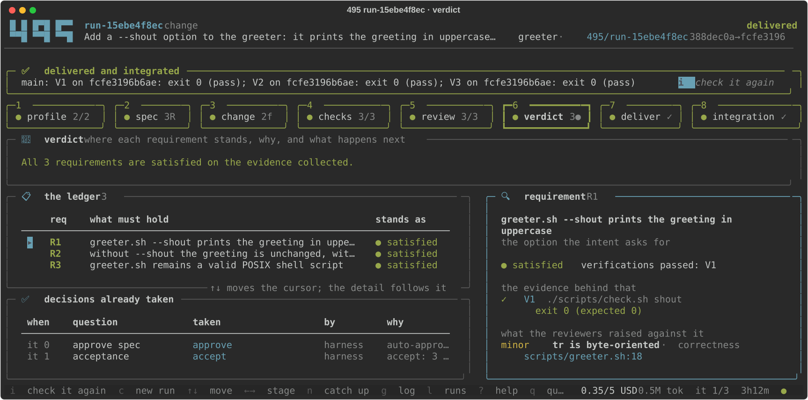
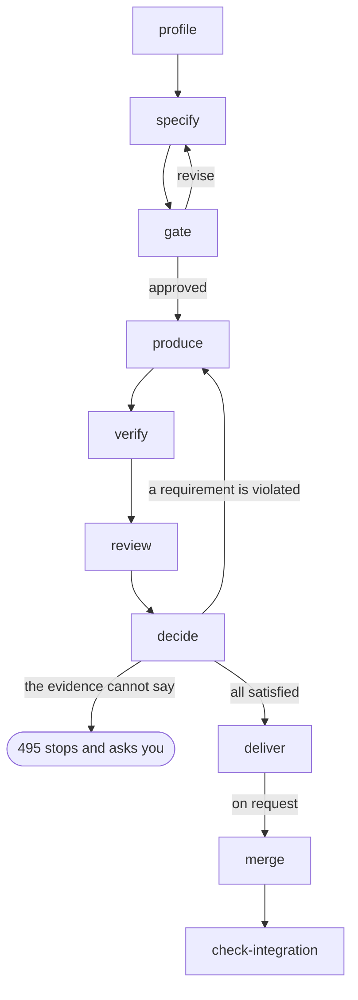

<p align="center">
   
</p>

<p align="center">
   <b>The agent harness that ensures quality</b><br>
</p>

<p align="center">

[](LICENSE)
[](https://www.python.org/)
[](https://www.anthropic.com/claude-code)
[](https://openai.com/codex/)
[](https://github.com/ollama/ollama)


</p>

**495 is an *agentic engineering harness*: a control plane that carries a software change from an intent to a
branch you can merge.** You write the request in prose; 495 has it specified, produced in
isolation, verified by your project's own commands and reviewed from independent perspectives,
then concludes on the evidence it collected — and hands you a patch, a branch and a report.

Every requirement, decision, intervention and piece of evidence is explicit and traceable. A
change is accepted only when the evidence supports it, never because the agent says it is done.
Nothing reaches your working tree until you ask for it, and what you merged is checked against
what was verified.


## Why 495?

495 is the three-digit ***Kaprekar constant***: a fixed point reached by repeatedly
applying a simple, deterministic rule to many different starting states.
Explore the step-by-step process at [6174.co.uk/495](https://www.6174.co.uk/495).

The name reflects 495's purpose: apply explicit rules and feedback at every stage until a
software change is cleared to merge.


## Available

- [x] **A control plane for coding agents**: Claude Code, Codex and any local model behind an OpenAI-compatible API do the work; 495 owns the workflow, the evidence and the accept-or-reject decision
- [x] **Spec-driven development**: from a prose intent to requirements `R1..Rn`, each tied to the verifications `V1..Vm` that decide it
- [x] **Produced in isolation**: every run works in a git worktree of its own, on branch `495/<run-id>`, created outside the project; your working tree is never touched
- [x] **Verified by your project's own commands**: detected or declared, and proven executable on the base version before anything is produced
- [x] **Independent review**: one read-only agent per perspective, structured verdicts, no access to the producer's transcript
- [x] **Decided on evidence**: each requirement becomes `satisfied`, `violated` or `undetermined`; evidence that cannot conclude stops the run and asks you
- [x] **Feedback that names the gap, not the fix**: a correction request states which requirement is not demonstrated and what was observed
- [x] **Instrument faults separated from defects**: a check that fails identically with and without the change is taken out of the evidence instead of becoming work
- [x] **A rich terminal UI**: eight stops in the order the engine walks them — where the run is, what each stage produced, and the controls that act on it
- [x] **Merge on request only**, in four shapes, followed by the integration check that inspects it
- [x] **Scoped permissions**: read-only roles and one write role, each under the isolation its client offers, with what was actually applied recorded per intervention
- [x] **Context engineering**: every prompt separates established facts from untrusted content
- [x] **Budgets and cost accounting**: cost is `reported`, `estimated` or `unknown`, never silently zero, and limits are enforced before each intervention
- [x] **Traceability**: one JSON document per run, an append-only event log, and every prompt, transcript, structured output and command output on disk
- [x] **Three interfaces over one engine**: a CLI (interactive or `--json`), a terminal UI, and an HTTP API
- [x] **Any target project**: 495 is written in Python, but only needs the commands your project declares

## Planned

Each item below is a gap 495 knows about — observed in its own behaviour, or in what has
actually been exercised. None of them is a dated commitment.

- [ ] **Docker isolation exercised against a live daemon**: the backend is unit-tested only
- [ ] **Correction iterations exercised with a live agent**: the loop is covered by test doubles and a fixed corpus
- [ ] **The merge over the HTTP API**: it can create, decide, resume, stop and check an integration, but not merge
- [ ] **The terminal UI on Windows**: it reads the keyboard through `termios`, and Seatbelt is macOS-only
- [ ] **Redaction of what leaves a run**: transcripts, command outputs and reports are written as captured
- [ ] **Exact context accounting for Codex**: only an upper bound is observable from its stream
- [ ] **A model catalogue**: any model string the client accepts is passed through, so an unknown one is only rejected by the client, and its cost is unknown rather than estimated


## Scope

- **Local only**: 495 works in a worktree of its own and never creates a remote branch, pushes, or alters a remote. The single command that writes to your checkout is `495 merge`, and only when you ask for it.
- **It does not replace human judgment**: when the evidence cannot decide, 495 stops, lays out the facts and hands the question back.
- **Independent of your toolchain**: 495 is written in Python; your project only has to declare the commands 495 must run.
- **One intent per run**: a run carries one intent to one branch, and keeps every attempt it made at it.


## Quick start

### Requirements

| Requirement | Purpose |
| --- | --- |
| macOS or Linux, Git, Python 3.11+ | Run 495. [uv](https://docs.astral.sh/uv/) is used when present; otherwise `venv` + `pip` |
| A Git repository with at least one commit | The base version every piece of evidence is measured against |
| At least one agent: [Claude Code](https://www.anthropic.com/claude-code) (`claude auth status`), [Codex](https://openai.com/codex/) (`codex login status`), or an OpenAI-compatible endpoint such as [Ollama](https://github.com/ollama/ollama) | The interventions. Only agent-driven commands need one |
| Optional: macOS Seatbelt (`sandbox-exec`, built in) or Docker | Isolation for local models and for the harness's own commands |

Tested on macOS. Linux is expected to work; Windows is not supported by the terminal UI.

### Install

```sh
git clone https://github.com/jeanjerome/495.git
cd 495
./run.sh --version
```

`run.sh` creates `.venv` on first use, installs the package, and hands every argument to the
CLI. The same CLI is installed as `495`; the examples below use `./run.sh` so they work from a
fresh clone.

### 1. See what is usable here — no agent called

```sh
./run.sh doctor
```

```text
                                            495 doctor
┏━━━━━━━━━━━━━━━━━━━━━━━━━━━━━┳━━━━━━━━━━┳━━━━━━━━━━━━━━━━━━━━━━━━━━━━━━━━━━━━━━━━━━━━━━━━━━━━━━━┓
┃ component                   ┃ ok       ┃ detail                                                ┃
┡━━━━━━━━━━━━━━━━━━━━━━━━━━━━━╇━━━━━━━━━━╇━━━━━━━━━━━━━━━━━━━━━━━━━━━━━━━━━━━━━━━━━━━━━━━━━━━━━━━┩
│ agent default (claude_code) │ yes      │ claude 2.1.269 at ~/.local/bin/claude                 │
│ agent codex (codex)         │ yes      │ codex 0.153.3 at ~/.local/bin/codex                   │
│ sandbox seatbelt            │ yes      │ macOS sandbox-exec                                    │
│ sandbox docker              │ NO       │ docker daemon not reachable: failed to connect to the │
│                             │          │ docker API                                            │
│ sandbox host                │ yes      │ host execution                                        │
│ git repository              │ yes      │ /path/to/project                                      │
│ selected sandbox            │ seatbelt │                                                       │
└─────────────────────────────┴──────────┴───────────────────────────────────────────────────────┘
```

`doctor` resolves every configured agent, probes each isolation backend and reports which one
will be selected. It calls no agent and consumes no quota.

### 2. Declare what makes a change correct

495 does not decide what makes a change correct. Your project does, in `.495/project.toml`.

```sh
./run.sh --project /path/to/project init
```

`init` writes `.495/config.toml` (agents, roles, budget, sandbox) and `.495/project.toml`
(verification commands, conventions, documents, allowed paths), adds `.495/` to
`.git/info/exclude`, and prints what it detected:

```text
languages: python, shell; tooling: pytest, ruff, mypy
base commit: 2f60d62c92c536d23a93e6ddc2abe1434fcd37bd; docs: README.md
              Project profile: /path/to/project
┏━━━━━━━━━━━┳━━━━━━━━━━━┳━━━━━━━━━━━━━━━━━━━━━━━━┳━━━━━━━━━━┓
┃ name      ┃ kind      ┃ command                ┃ source   ┃
┡━━━━━━━━━━━╇━━━━━━━━━━━╇━━━━━━━━━━━━━━━━━━━━━━━━╇━━━━━━━━━━┩
│ test      │ test      │ python -m pytest -q    │ detected │
│ lint      │ lint      │ python -m ruff check . │ detected │
│ typecheck │ typecheck │ python -m mypy .       │ detected │
└───────────┴───────────┴────────────────────────┴──────────┘
```

Commands are detected from `pyproject.toml`, `package.json`, `Makefile`, `Cargo.toml`,
`go.mod` and the like. Declaring one in `project.toml` under the same name overrides the
detected command; any other name adds one. `495 profile` re-runs the detection alone.

Detection is not a contract. Every command is run once on the base version at the start of a
run — that is the **readiness** check — and a command that cannot run there, or that already
fails there, becomes a question rather than a silent failure later.

### 3. Hand a change to an agent

> ⚠️ **This command contacts an agent service and consumes agent quota.**
> A run is at least one specification, one production and one intervention per reviewer —
> five with the default roles — plus one production and one review round per correction
> iteration.

```sh
./run.sh --project /path/to/project new \
  "Add a --shout option to the greeter: it prints the greeting in uppercase. \
   Extend the check script to cover the option, both on its own and with a name."
```

495 profiles the project, writes the specification, stops for your approval, produces the
change in its own worktree, runs the verification commands on the exact commit it produced,
sends the result to the reviewers, and concludes:

```text
╭─────────────────────────────────────────── 495 run ────────────────────────────────────────────╮
│ run-15ebe4f8ec  status delivered  outcome accept  iteration 1  interventions 5  tokens 314900  │
│ cost 0.3500 USD (reported)                                                                     │
╰────────────────────────────────────────────────────────────────────────────────────────────────╯
┏━━━━━┳━━━━━━━━━━━┳━━━━━━━━━━━━━━━━━━━━━━━━━━━━━━━━━━━━━━━━━━━━━━━━━━━┳━━━━━━━━━━━━━━━━━━━━━━━━━━┓
┃ req ┃ status    ┃ statement                                         ┃ reason                   ┃
┡━━━━━╇━━━━━━━━━━━╇━━━━━━━━━━━━━━━━━━━━━━━━━━━━━━━━━━━━━━━━━━━━━━━━━━━╇━━━━━━━━━━━━━━━━━━━━━━━━━━┩
│ R1  │ satisfied │ greeter.sh --shout prints the greeting in         │ verifications passed: V1 │
│     │           │ uppercase                                         │                          │
│ R2  │ satisfied │ without --shout the greeting is unchanged, with   │ verifications passed: V2 │
│     │           │ and without a name                                │                          │
│ R3  │ satisfied │ greeter.sh remains a valid POSIX shell script     │ verifications passed: V3 │
└─────┴───────────┴───────────────────────────────────────────────────┴──────────────────────────┘
accept: 3 satisfied, 0 violated, 0 undetermined requirement(s); 0 correction request(s)
version: branch 495/run-15ebe4f8ec at 1c371dc44b58, patch artifacts/iteration-1.patch
report: .495/runs/run-15ebe4f8ec/artifacts/report.md
```

Nothing has been merged. The branch and the patch are yours to take, and `--auto-approve`
skips the specification gate when the specification has no verification gap.

### 4. Merge it, then check what you merged

```sh
./run.sh merge run-15ebe4f8ec --how fast-forward --rerun
```

```text
integrated as fast-forward: 495/run-15ebe4f8ec is in 1c371dc44b58, and it carries what was verified
```

`merge` is the only command that writes to your checkout. It brings the delivered branch into
the branch you have checked out and immediately runs the integration check on the result. If
you would rather integrate by hand — a cherry-pick, a pull request, a patch applied elsewhere —
do it your way and ask afterwards:

```sh
./run.sh check-integration run-15ebe4f8ec --ref main --rerun
```

```text
integration verified: V1 on 1c371dc44b58: exit 0 (pass); V2 on 1c371dc44b58: exit 0 (pass);
V3 on 1c371dc44b58: exit 0 (pass)
```


## The terminal UI

`495 watch` opens the run as the workflow: eight stops in the order the engine walks them, in
the vocabulary of the table below. 495 calls it the **run surface**, and the name is the whole
idea: a stop is *where the run is*, *the tab that shows what that stage produced*, and *where
the controls that act on it live*, so there is no menu to learn — you look for a fact, or act
on it, at the stage it belongs to. It is also where a run starts: type an intent, and the run
it opens walks the same eight stops in front of you.

<p align="center">
   
</p>

Four things carry the surface:

- **The navigation bar is the pipeline.** Each stop is a framed tab with its own key and its own
  count, so the strip is also a dashboard: checks at 4/6 and a blocker on the review are legible
  without opening either. Colour is the state of the *run* at that stop — green walked, cyan
  working, grey ahead, magenta stopped to ask you; a heavy frame is where *you* are looking.
- **One line always says what the run needs from you** — not started, working, waiting on you,
  delivered, or standing still because nothing is advancing it — with the key that answers it.
  A decision is rendered in the body of the stage that raised it, not behind a keystroke.
- **Every stage has the same shape: headline, list, detail.** The headline is one sentence
  stating what the stage concluded and why. The detail follows the cursor rather than replacing
  the list, so arrowing down a list of checks reads their outputs in place; `enter` sends the
  full command log to your pager.
- **The run is driven from where it is read.** `c` takes an intent — or an existing change to
  evaluate — and starts the run on it; `s` advances it until it finishes or needs you, and
  resumes a paused or failed one at the phase it stopped at; `p` pauses it after the step it is
  on; `d` answers the question it stopped on and lets it carry on; `m` brings the delivered
  branch into the branch you are on and checks the result; `i` checks a ref you merged into
  yourself. A control is offered only where pressing it would do something, so the keys on
  screen are the moves that exist right now.

Keys: `1`-`8` or `←` `→` walk the pipeline, `n` catches up to where the run is, `↑` `↓` move the
cursor, `g` the event log (`f` filters it), `l` every run in the store, `space` freezes the
display, `?` help, `q` quit — the run keeps going without the surface. Without a terminal the
same surface prints and asks with the same vocabulary, controls included, so a piped session
loses nothing.

The engine claims a run while it advances it, so a surface opened on a run another terminal is
already driving watches it rather than joining in, and both are looking at the same files. A
claim left by a process that is gone is taken over rather than honoured. `--read-only` shows the
surface without its controls; `--print` renders one view and exits, `--export view.svg` captures
it. `HARNESS495_ICONS=ascii` (or `--ascii-icons`) draws panel titles with geometric marks
instead of emoji.

Interruptions (`p` on the surface, Ctrl-C, `495 stop <id>` from another shell) pause the run
after killing the current agent; `s` on the surface, or `495 resume <id>`, continues at the
phase that was interrupted.


## Mental model

### The workflow



| phase | what happens | who |
|---|---|---|
| profile | detect languages, tooling, verification commands and conventions; run every command once on the base version to prove it is executable and record what it printed (**readiness**) | harness |
| specify | turn the intent into requirements `R1..Rn`, each tied to verifications `V1..Vm`; flag missing or insufficient verifications and propose new tests to create | specifier agent (read-only) |
| gate | approve the specification (human, or `--auto-approve` when there is no gap) | you |
| produce | implement the change in the worktree; the harness commits the result so the evaluated version is one exact commit | producer agent (write) |
| verify | scope check (only allowed paths touched), then every verification command on that commit, output and hashes kept as evidence; every failing command is re-run on the base version, and one that fails identically there is marked as not observing the change | harness |
| review | independent reviewers, one per perspective (spec compliance, correctness, security, ...) with read-only access, structured verdicts; a reviewer that alters the tree has its verdict discarded | reviewer agents |
| decide | each requirement becomes `satisfied`, `violated` or `undetermined` from the evidence; violations produce correction requests and a new iteration; insufficient evidence stops the run and asks you | harness / you |
| deliver | patch, branch and Markdown report; nothing is merged | harness |
| merge | on request only: brings the delivered branch into the branch you have checked out — fast-forward, rebase, squash or merge, three of which leave a linear history — followed by the integration check. Refuses an unclean tree or a branch that already carries the change, and puts the branch back rather than leaving a conflict | harness, at your word |
| check-integration | after you merged or applied the patch: does the target ref contain the commit / identical files, optionally re-run the verifications. A ref still sitting on the commit the run branched from is reported as not merged into yet, which is not a mismatch and not a failure | harness |

The target project must be a git repository with at least one commit. 495 never touches your
working tree: it works in a dedicated git worktree on branch `495/<run-id>`, created outside
the project under `~/.cache/495/worktrees/<project>-<hash>/` (override with
`HARNESS495_WORKTREES_DIR`), and stores its state under `<project>/.495/runs/<run-id>/`. The
project tree is fingerprinted around every intervention: an agent that escapes its worktree is
detected, the escape recorded as integrity evidence, and a producer escape stops the run.

### Requirements and what is allowed to decide them

A requirement is never decided by the agent that implemented it.

| evidence | produced by | decides |
| --- | --- | --- |
| `command_result` | a verification command, run by the harness on the evaluated commit | whether the requirements that command carries hold |
| `scope_check` | the harness, from the diff | whether the change stayed inside the allowed paths |
| `review_verdict` | a read-only reviewer, one per perspective | a violation, with the observation that supports it |
| `instrument_check` | the harness, re-running a failing command on the base version | whether the command observes the change at all |
| `integrity` | the harness, fingerprinting the tree around an intervention | whether the evidence can be trusted |
| `baseline` | the harness, before anything is produced | whether the command could run here in the first place |

A requirement is `satisfied` only when every verification attached to it ran on the evaluated
commit and passed, and no reviewer reports a violation with evidence. A failed verification or
an evidenced violation makes it `violated`. Anything else is `undetermined`, and an
undetermined requirement blocks acceptance: the run stops and asks rather than concluding.

> `satisfied` means the named command passed on the evaluated commit. It does not prove that
> the command measures the requirement. That mapping is part of the specification, and
> reviewing it is yours — which is why the specification is shown in full before you approve it.

### Iterations, and what a correction request may say

A correction request says which requirement is not demonstrated and what was observed, never
what to change: the target is the behaviour a requirement describes, and a verification is only
how the harness looks at it. For the same reason a reviewer's own explanation stays out of the
producer's context, and a verification that fails with and without the change is taken out of
the evidence instead of being turned into work for the producer.

An iteration that delivers the same tree as the previous one is not run again; it becomes a
question. So does reaching `max_iterations`, or the budget.

### Decisions you may be asked to take

- `approve_spec`: approve / approve_with_gaps / revise (note) / abort. The specification is
  printed in full before the question, saved to `artifacts/spec.json` (the path is in the
  question), carried in the decision's `context.spec`, and readable at any time with `495 spec <id>`.
- `readiness`: a verification command cannot run here: drop / retry / abort; or it already fails on
  the base version, so nothing it reports later can be attributed to the change: proceed /
  allow_network (re-run with the network open to the verification commands, for builds that
  resolve dependencies on first use) / retry / abort.
- `instrument_fault`: a verification fails the same way with and without the change, so it cannot
  show whether the requirements it carries hold: respecify (note) / ignore / abort.
- `no_progress`: an iteration delivered the same tree as the previous one: respecify (note) /
  review_anyway / stop / abort.
- `undetermined`: evidence insufficient to conclude: accept_with_risk (note) / rerun / correct (note) / abort.
- `iteration_limit`: continue / stop / abort.  `budget`: raise (note = extra USD) / abort.

Every option states what taking it does to the run, and the facts behind the question — where
each requirement stands, the outstanding corrections, what the producer reported it could not do
— are laid out above it rather than packed into the question.

Non-interactively, a run exits with code 3 and prints the pending decision as JSON; answer with
`495 decide <id> <choice>` (which resumes by default).

### What the agents get, and what they can do

Each intervention receives a context pack with two clearly separated parts: **established facts**
(the approved specification, the project profile, the exact version, the evidence the harness
collected itself) and **untrusted content** (diffs, repository documents, other agents' output),
labelled as data that may contain misleading instructions. Reviewers never see the producer's
transcript; producers see correction requests derived from evidence, that evidence, and the
reviewers' observations without their explanations.

| agent | read-only roles | write role | isolation |
|---|---|---|---|
| Claude Code | `--tools Bash,Read`, Bash limited to read-only patterns, `--permission-mode dontAsk` | `--permission-mode acceptEdits`, tools Bash/Edit/Write/Read | Claude Code sandbox enabled with no allowed network domain, permission prompts disabled, session not persisted |
| Codex | `--sandbox read-only` | `--sandbox workspace-write` | `network_access=false`, ephemeral session |
| OpenAI-compatible | bash loop in the harness sandbox, read-only | same, writable | Seatbelt (no network, writes limited to the worktree and the scratch directories) or Docker (`--network none`), else host with a warning |

Every intervention records the agent identity (kind, model, CLI version, session id), the tools
allowed, the isolation actually applied, the working directory, the timeout, tokens, context
window utilisation, cost, and the tool activity observed in the transcript (e.g. `Bash 5,
Edit 2`). Claude Code transcripts are kept in full (`stream-json`).

Local models must be able to follow a simple protocol (one fenced `bash` block per turn, a
`final` block to finish, JSON output when asked). Small models (around 1-2B parameters) tend
to loop or ignore the format; the loop detects that and fails the intervention instead of
spending the budget. A 7B coder model is the practical minimum. Budgets (`max_cost_usd`,
`max_interventions`, `max_iterations`, timeouts) are enforced before each intervention; Claude
Code also receives `--max-budget-usd`.

Cost is `reported` when the agent states it (Claude Code), `estimated` from
`harness495/data/pricing.json` (copy it to `~/.config/495/pricing.json` to adjust) when only tokens
are known, and `unknown` otherwise — never silently zero.

### Traceability

`<project>/.495/runs/<id>/` holds `run.json` (validated by `495 schema run`), `events.jsonl`,
one directory per intervention (rendered prompt, context summary, raw transcript, structured
output, identity), one per evidence (command output), and `artifacts/` (patches, `report.md`).
`495 export <id>` archives it, `495 validate run.json` re-validates one, and Git remains the
source of history.


## Command reference

```
495 new "<intent>" [--agent kind[:model]] [--producer ...] [--reviewer perspective[=agent]]...
        [--max-cost USD] [--max-iterations N] [--timeout S] [--auto-approve] [--spec spec.json]
        [--sandbox host|seatbelt|docker] [--allow-network] [--allowed-path GLOB]... [--no-start]
495 eval "<intent>" [--ref <commit> | --ref <base>..<head> | --patch file.diff]
495 run <id> | resume <id> | stop <id>
495 decide <id> <choice> [--note "..."]
495 spec <id>
495 status <id> | list | events <id> [-f] | report <id> [--format md|json] [-o file]
495 watch [<id>] [--stage checks] [--read-only] [--print] [--export view.svg]
495 merge <id> [--how fast-forward|rebase|squash|merge] [--rerun]
495 check-integration <id> [--ref main] [--rerun]
495 export <id> | cleanup <id> [--delete] | schema run|event|spec|config | validate run.json
495 profile | init | doctor | serve [--port 4950]
```

| Command | Purpose | Uses an agent? | Writes to the target project? |
| --- | --- | --- | --- |
| `495 new` | Drive an intent through the full workflow | Yes | Only in the run's own worktree |
| `495 eval` | Verify and review an existing change | Yes, minus the producer | Only in the run's own worktree |
| `495 run`, `resume`, `decide` | Advance a run, or answer the question it stopped on | Yes, for the phases left to walk | Only in the run's own worktree |
| `495 stop`, `cleanup` | Pause a run; remove the worktree it created | No | Only the run's own worktree |
| `495 merge` | Bring the delivered branch into the branch you are on, then check it | No | **Yes — this one command, when asked** |
| `495 check-integration` | Compare a ref you integrated against the verified version | No | No |
| `495 watch` | Open the terminal UI | Through the runs its controls drive | In the run's worktree, and to your checkout with `m` |
| `495 profile`, `doctor`, `init` | Detection, availability, configuration | No | `init` writes `.495/` |
| `495 status`, `list`, `events`, `spec`, `report`, `export`, `schema`, `validate` | Read what a run recorded | No | No (`export` writes its archive to the working directory) |
| `495 serve` | Expose the same workflow over HTTP | Through the runs it starts | No |

Global options, before the command: `--project`/`-C` (target project, default the working
directory), `--state-dir` (default `<project>/.495`), `--json` (machine-readable output, no
prompts), `--version`. `./run.sh` with no arguments opens an interactive menu over the same
engine.

### `495 new`

| Option | Default | Purpose |
| --- | --- | --- |
| `--agent` | `.495/config.toml` | Agent for every role: a name from the configuration, or `kind[:model]` |
| `--specifier`, `--producer` | `--agent` | Override one role |
| `--reviewer` | three perspectives | `perspective[=agent]`, repeatable; replaces the configured reviewers |
| `--spec` | — | Use a JSON specification instead of calling the specifier |
| `--auto-approve` | off | Approve the specification when it has no verification gap |
| `--max-cost`, `--max-iterations`, `--timeout` | `10.0`, `3`, `1800` | Budget for this run |
| `--sandbox` | `auto` | `host`, `seatbelt` or `docker` |
| `--allow-network` | off | Let the verification commands reach the network |
| `--allowed-path` | `[scope] allowed_paths`, else the specification's | Glob the change may touch, repeatable |
| `--no-start` | off | Create the run without advancing it |

### `495 eval`

Evaluate a change that already exists — no producer is mobilised, and nothing is implemented.

```sh
495 eval "what this change is supposed to accomplish" --ref HEAD
495 eval "..." --ref main..feature-branch
495 eval "..." --patch change.diff
495 eval "..."                            # the uncommitted working tree
```

All four inputs are materialised as one commit in the run's worktree, so the evidence always
points at a SHA, exactly as for a produced change.

### `495 merge` and `495 check-integration`

`--how` picks the shape of the history: `fast-forward` (the default, and only offered while
your branch has gone nowhere since the run branched off it) moves your branch onto the verified
commit and adds nothing; `rebase` copies the run's commits on top of yours; `squash` puts
everything into one commit, whose message says which commit was verified and by which run;
`merge` keeps the verified commit as an ancestor under a merge commit.

`rebase` and `squash` copy the change rather than move it, so the delivered commit is then
absent from your branch and only the file contents say the right thing landed — which is why
the check reads both. An unclean tree, a branch that already carries the change, and a conflict
are each refused, and each leaves the repository exactly as it was found.

`check-integration` answers one of four words: `unchecked` (nothing has been asked),
`unmerged` (the ref is still where the run started — not a failure), `landed` (it carries the
verified change) or `differs` (it carries something else, which is the failure this check
exists to catch).

### Configuration

`495 init` writes two TOML files under `.495/`. A user-level `~/.config/495/config.toml` is
read first; the project file overrides it; command-line options override both.

`config.toml` — agents, roles, budget, sandbox:

```toml
[agents.default]
kind = "claude_code"      # claude_code | codex | openai_compat
model = "sonnet"

[agents.reviewer]
kind = "codex"

[agents.local]
kind = "openai_compat"
base_url = "http://localhost:11434/v1"
model = "qwen2.5-coder:7b"
context_window = 32768

[roles]
specifier = "default"
producer = "default"
reviewers = [
  { perspective = "spec_compliance", agent = "reviewer" },
  { perspective = "correctness", agent = "default" },
  { perspective = "security", agent = "local" },
]

[budget]
max_cost_usd = 10.0
max_iterations = 3
intervention_timeout_s = 1800
context_warn_ratio = 0.75

[sandbox]
backend = "auto"          # auto | host | seatbelt | docker
```

`project.toml` — the project's own criteria: verification commands (detected ones can be
overridden by name), conventions, documentation files to show the agents, allowed and
forbidden paths.

```toml
conventions = ["shell scripts stay POSIX sh"]
docs = ["CONTRIBUTING.md"]

[scope]
allowed_paths = ["src/**", "tests/**"]
forbidden_paths = [".495/**", ".git/**", ".github/**", ".gitlab-ci.yml"]

[[commands]]
name = "test"
command = "pytest -q"
kind = "test"             # command | test | lint | build | typecheck
```

Built-in reviewer perspectives: `spec_compliance`, `correctness`, `security`, `test_quality`,
`standards`, `maintainability`; any other name works with a generic brief, and `instructions`
in a reviewer entry replaces the brief.

### Exit codes

| Code | Meaning |
| --- | --- |
| `0` | The command completed what it was asked: a run delivered, a check verified, a document written |
| `1` | The run failed, or the command could not be carried out |
| `3` | The run is waiting for a decision; the pending question is on standard output with `--json` |
| `4` | The run was rejected or aborted, or an integration carries something other than what was verified |

Exit code `3` is an intentional pause, not an error. A malformed command line exits `2`,
before anything is read or run.

### Follow execution

While a run works, the phase it is in, the iteration, what it is doing right now and what it has
spent against the budget stay on a status line at the bottom of the terminal; the transitions
themselves are not printed, since the line already says where the run is.

Everything a run does is also an event: `495 events <id> -f` follows them, `495 watch` renders
them, and `--json` turns them into JSON lines. Every command takes `--json`, which also disables
prompting — a run that needs an answer exits `3` with the question on standard output rather
than waiting for a keystroke. The terminal UI is the one exception: it has no machine-readable
form, and says so.

### JSON documents and the HTTP API

`495 schema run|event|spec|config` prints the JSON schema of each persisted document, generated
from the models 495 itself validates against. `495 validate <run.json>` checks a document.

`495 serve` publishes the same workflow over HTTP on `127.0.0.1:4950`:

```
GET  /health
GET  /runs                        POST /runs                      create a run (and start it)
GET  /runs/{id}                   POST /runs/{id}/decisions       answer a pending decision
GET  /runs/{id}/events?offset=N   POST /runs/{id}/resume
GET  /runs/{id}/report            POST /runs/{id}/stop
GET  /schema/{run|event|spec|config}
                                  POST /runs/{id}/check-integration
```

The API creates, advances, answers and inspects runs; it does not merge.


## Known limitations

495 is at version `0.1.0` and under active development. The workflow, the documents it writes
and the commands that drive them are still moving, and none of them is a stable contract yet.
What this README describes is what the code does today.


## Further reading

| Document | Purpose |
| --- | --- |
| `495 schema run` | The shape of a run document: requirements, interventions, evidence, decisions, result |
| `495 report <id>` | The Markdown restitution of one run: what was asked, what was produced, what was observed, what was concluded |
| `harness495/interfaces/tui/__init__.py` | How the run surface is laid out, and the two rules that hold it together |

## Development

```bash
./run.sh --version                       # creates .venv and installs the package with dev extras
.venv/bin/python -m pytest -q            # unit, adapter (fake CLIs) and end-to-end (fake agents) tests
.venv/bin/ruff check harness495 tests && .venv/bin/ruff format --check harness495 tests
.venv/bin/mypy harness495
```

`pytest -m live` runs the tests that call real agent CLIs; they are deselected by default.


## License

[Apache License 2.0](LICENSE) © 2026 Jean-Jerome Levy.
