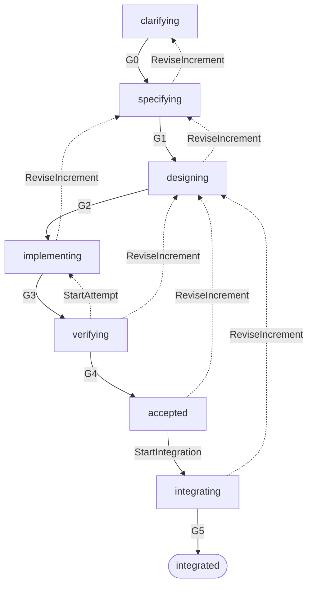
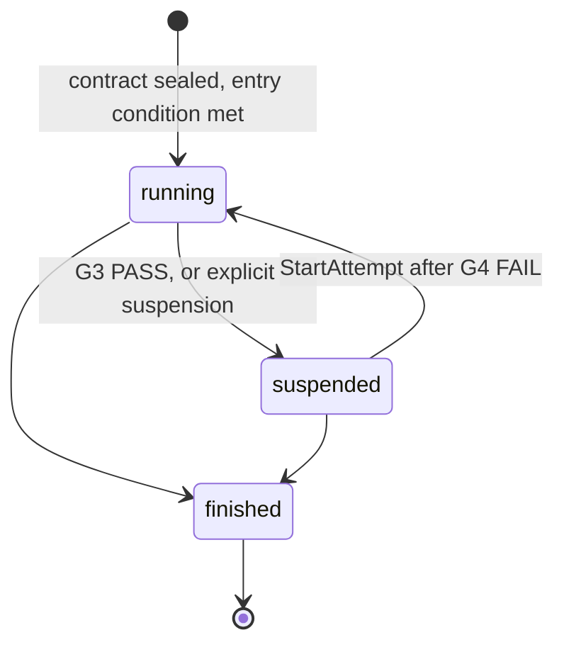

# 495

**495** frames AI-assisted software development with an explicit, verifiable and bounded work loop.

The name comes from the *Kaprekar constant* for three-digit numbers. Take any number with at least two distinct digits, order its digits both ways, subtract the smaller from the larger, and repeat while keeping leading zeros: you always reach 495, where the process stabilises (`954 − 459 = 495`). The convergence illustrates the project's aim — moving variable output toward a result whose conformance can be checked. It does not promise that an AI will produce the same code twice.

The name is pronounced "four nine five". The commands `495 init`, `495 run` and `495 verify` are envisaged interface names; no CLI contract defines them and none is implemented.

> **Status.** This repository holds a **design proposal**, not an implementation. It describes contracts to be built; it offers no experimental evidence of reliability. The authoritative current state is [`495/project.json`](495/project.json), checked by `python3 tools/verify_state.py`.

## Principle

An agent ticking "task done" is a claim, not a result. Only the controller applies a transition, and a favourable decision requires evidence bound to the exact inputs it concerns — by digest, never by path.

Requirements state the expected outcome, design structures the solution, and checks confront the implementation with the requirements. Observed gaps drive corrections until the acceptance criteria hold, or until a human decision becomes necessary.

## Workflow

An increment moves through the phases its profile requires. Every forward step is carried by a named command and, where applicable, gated.



The six gate crossings are carried by `ApplyGateDecision`. `CloseIncrement` leads to a terminal `closed` phase from any non-terminal phase, given a valid reason and no unreconciled external effect. `integrated` and `closed` have no outgoing edge: an integrated increment is not reopened, its evolution goes through a new increment.

A return carried by `ReviseIncrement` ends the current attempt and opens a working revision. The `verifying → implementing` correction, carried by `StartAttempt`, leaves the contract unchanged and keeps the attempt.

The diagram shows one return edge per source phase. `ReviseIncrement` actually targets `specifying` or `designing` depending on which artifact is revised — ten edges in all, against a single correction edge.

| Gate | Guarantee | Limit |
| --- | --- | --- |
| **G0** — need framed | The work is scoped | Its economic value is not demonstrated |
| **G1** — specification ready | An approved, verifiable specification exists | Its correctness does not follow from the parser |
| **G2** — execution contract ready | The contract is sealed before actuation | No future result is promised |
| **G3** — candidate admissible | The candidate can be evaluated | It is not yet correct |
| **G4** — candidate accepted | The policy's criteria hold on this exact candidate | Under these checks and this scope only |
| **G5** — integrated | The integrated state matches the accepted candidate | — |

Evaluating a gate is a pure function returning `PASS`, `FAIL` or `INDETERMINATE`. Missing evidence, a malformed result, or a mandatory check that did not run never amount to success.

### Attempts

An AI attempt exists in every phase, created once its phase contract is sealed and the phase's entry condition is met — a gate where one applies, a required contract always.



`suspended` is not terminal: it keeps the sealed contract, so a review attempt can run while the implementation attempt is paused. Reaching `finished` requires one of six declared reasons — `phase_completed`, `integration_succeeded`, `revision_requested`, `increment_closed`, `budget_exhausted`, `definitive_failure` — each with exactly one trigger. A gate `FAIL` never ends an attempt on its own.

## The `495/` directory

`495/` is where the harness keeps a project's state and its sealed record. It is the shape 495 defines for any target project, and this repository applies it to itself.

Its role is to make every conclusion traceable to the exact bytes it concerns: an artifact is identified by the SHA-256 of its content, a revision is immutable, and an approval binds to a full reference rather than to a file path.

```
495/
├── project.json              identity, profiles, increments, state_version, known gaps
├── approvals.json            approvals and refusals, each on a full reference
├── specs/                    requirements currently integrated
├── decisions/                ADRs and their manifest
├── changes/<INC-nnnn>/       one directory per increment
│   ├── manifest.json         sealed artifacts, their digests and adopted references
│   ├── proposal.md           objective, scope, exclusions, open questions
│   ├── requirements.json     identified requirements, criteria, verification method
│   ├── features/             Gherkin scenarios, where relevant
│   ├── design.md             components, interfaces, risks, test strategy
│   ├── contracts/            phase and execution contracts, interface contracts
│   ├── tasks.json            bounded tasks and dependencies
│   ├── attempts/             attempt state — mutable, never sealed
│   ├── observations/         recorded results of an operation or check
│   └── gates/                gate decisions: inputs, obligations, reasons, verdict
└── objects/sha256/           preserved bytes, addressed by their digest
```

A path is present only once its artifact exists; an absent directory means the work has not been produced.

| Defined by the design (§4.1) | Bootstrap extension |
| --- | --- |
| `project.json`, `specs/`, `decisions/`, `changes/<INC>/` and its documents | `manifest.json`, `gates/`, `attempts/`, `observations/`, `objects/`, `approvals.json` |

**These conventions carry no security property.** No controller exists yet: phases, gates and approvals are held by hand, and the records under `495/` are readable public conventions. A manifest lets you observe drift between approved bytes and those on disk; it does not prevent it. The design says so itself in §4.1 — the controlled store must not be a directory of the agent's workspace. The enforceable configuration remains an approved copy held by the controller.

## Separation of concerns

| Party | Responsibility |
| --- | --- |
| **495** | Organise the work, prepare the AI's context, run the gates, preserve evidence |
| **Target application** | Requirements, design, code, tests and build configuration |
| **Execution environment** | Run agents, builds and checks, behind an adapter |
| **AI provider** | Produce or review proposals, through an interchangeable adapter |

Python is the internal technology chosen for the future implementation, but no language, test framework or build system is imposed on the target application. The distribution is meant to embed its runtime, libraries and methodological resources, so the core needs no manually installed tool.

## Workflow profiles

| Profile | Source | Use |
| --- | --- | --- |
| `standard` | §3.5 | Requires an authorized worker and the three isolation capabilities of §6.8 |
| `exploration` | §3.1 | Produces knowledge and decisions; may be closed without code |
| `self-hosting-bootstrap` | `ADR-0006` | Build 495 before a worker exists, with its limits declared |

The bootstrap profile is not an exception to the standard one: §3.6 only allows excepting an identified baseline defect, never a hard technical obligation. It is a separate profile, bound by the **digest** of its definition rather than by its name, and its sunset requires — cumulatively — a worker implementing CSAP 1.0 that passed its conformance kit, the three isolation capabilities qualified separately, and compatibility with the toolchain in use.

A result obtained under it is functional bootstrap evidence. It is never evidence of isolation or of verifier separation, and it must be re-evaluated under the standard profile before any claim of conforming self-hosting.

## Core invariants

- Only the controller applies a transition; neither an agent nor an adapter can accept a result.
- A sealed artifact is immutable; any change creates a new revision.
- Evidence remains valid through the digests of its inputs, not through its former "passed" status.
- The accepted candidate is the verified candidate.
- A favourable model judgment never neutralises a mandatory deterministic violation.
- A structural gate does not claim to prove a document's business relevance.

The threat model treats agent code and output as untrusted. The controller, its object store, the trust configuration and authorized workers sit inside the trust boundary.

## Adapter protocol

Four ports isolate 495 from target technologies: `AgentPort`, `ExecutionPort`, `RepositoryPort` and `ApprovalPort`. Adapters behind them speak CSAP 1.0, an application protocol proposed by the project, with versioned JSON envelopes and idempotent asynchronous operations.

A project's adapter translates requested capabilities — build, run acceptance tests, check architecture and contracts, produce a candidate — into operations suited to its technology, and returns a normalised result naming the check, the requirements covered, the input digests, the verifier version, the status and the evidence.

## Documents

| Path | Contents |
| --- | --- |
| [`495/changes/INC-0001/design.md`](495/changes/INC-0001/design.md) | The design: invariants, workflow, core, adapter protocol |
| [`495/changes/INC-0001/proposal.md`](495/changes/INC-0001/proposal.md) | Needs, methods retained and embeddable technical foundation |
| [`495/decisions/`](495/decisions/) | ADRs refining or replacing passages of the sealed design |
| [`tools/verify_state.py`](tools/verify_state.py) | Partial bootstrap consistency check, without authority |
| [`docs/presentation.md`](docs/presentation.md) | Origin of the name and intent of the project |

## Guarantees not claimed

Model determinism, semantic completeness of tests, a universal sandbox with no system dependencies, strong human identity in local mode, immunity to an administrator of the controller, multi-repository atomicity, perfect parity between production and test environments.

## References

- [GitHub Spec Kit](https://github.com/github/spec-kit) — separating specification, plan and task artifacts
- [OpenSpec](https://github.com/Fission-AI/OpenSpec) — organising work by change proposal
- [BDD — Cucumber](https://cucumber.io/docs/bdd/), [Gherkin](https://github.com/cucumber/gherkin), [Cucumber Messages](https://github.com/cucumber/messages)
- [ADR](https://adr.github.io/) and [OpenAPI](https://www.openapis.org/what-is-openapi)
- [Agile principles](https://agilemanifesto.org/principles.html)
