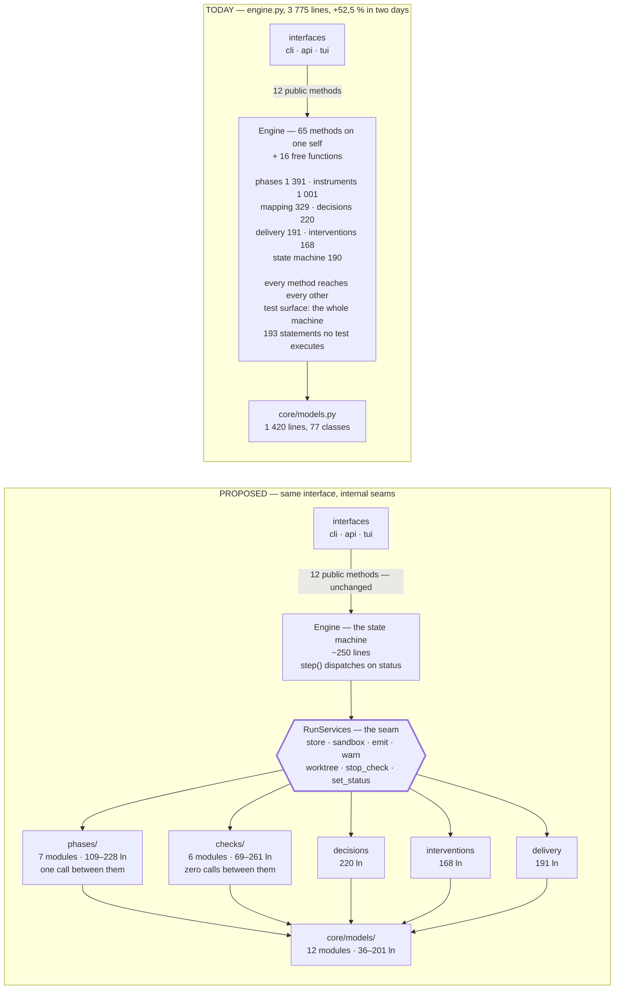

# Architecture review

Date: 2026-09-14 · version `0.1.0` · 59 commits · `harness495` at 24 661 lines, 548 tests.

What this reviews: **how 495 is built** — the shape of its modules, where its seams are, what its
suite measures and what it does not. It does not review what the harness does; that axis belongs
to `docs/etude-harnais-495.md`, which tracks capability gaps as `E01`..`E61`. The boundary and the
one place the two overlap are stated in [01-method.md](01-method.md).

Every claim below carries the command or the `file:line` that produced it. Nothing here is a
judgement offered without a measurement behind it.

## The documents

| | |
|---|---|
| [01-method.md](01-method.md) | The vocabulary, the two axes, the severity scale, the evidence rule; what was taken from each skill collection and what was left |
| [02-measured-state.md](02-measured-state.md) | What holds today, with evidence; the numbers; the growth curve |
| [03-findings.md](03-findings.md) | Six defects — one Critical, five Important — each with a failure scenario and a remedy |
| [04-deepening.md](04-deepening.md) | Five deepening candidates, before/after, with a recommendation strength; two corrected after measurement |
| [05-language.md](05-language.md) | The domain glossary 495 does not yet have, and the one term that carries two meanings |
| [06-plan.md](06-plan.md) | Sequenced work, and the decisions that are the requester's |
| [07-layout.md](07-layout.md) | The directory layout the import graph and the commit history argue for, and the rule for where to stop splitting |

## The finding

`core/engine.py` went from 2 475 lines to 3 775 across 2026-09-13 and 2026-09-14 — **+52,5 %, of
which +1 270 on the second day alone, across nine `feat` commits, none of which removed anything**.
Its external interface did not move: twelve public methods, and `interfaces` reaches past them at
one point only, a free function it imports twice. The module is *deep* at the seam it presents and
*undifferentiated* behind it: 65 methods on one `self` plus 16 free functions in the same file,
seven collaborators that every region uses and nothing constraining the rest.

The size is not the problem. The trend is. Each invariant the harness gains costs 100 to 420 lines
in that one file, and every one of them also costs lines in `models.py`, `context.py` and `cli.py`
in the same window. The étude noticed the concentration at 2 475 lines and recorded it inside `E45`,
an entry since marked resolved — so the observation has no id, no remedy, and no bound.

## The recommendation

Give `engine.py` **internal seams**, and leave its external interface exactly as it is.

The measurement that makes this cheap: every region of the engine reaches for the same seven
collaborators (`store`, `emit`, `sandbox`, `_worktree`, `_stop_check`, `_warn`, `_set_status`), and
four of the seven regions reach for nothing else at all. That set is the seam. It was not designed;
it is what the code already does. The region that crosses it first — the checks — reaches exactly
two things beyond it; the phases reach eight, which is why they go last.



What moves is the inside; what stays is the arrow at the top. The
verification-and-instruments region — 1 001 lines, 17 definitions — touches no agent and no phase,
and reaches exactly two things outside itself, which makes it the cheapest region to cross the seam
first.

The 193 unexecuted statements are not concentrated in it, or anywhere: phases 61, decisions 41,
agent-output mapping 38, instruments 28, state machine and infrastructure 14, delivery 6,
interventions 5 — 193, partitioned. No soft spot to patch — every region is hard to reach for the
same reason, which is that there is only one way in.

## The layout

The seam is one change. Taken with the two splits that make the purity contract expressible, and
with the files whose size comes from holding several concepts rather than many cases, it leaves
this:

```
harness495/
├── core/
│   ├── models/              12 modules along the 12 sections the file already carries
│   ├── engine/
│   │   ├── engine.py       ~250   the state machine and the twelve public methods
│   │   ├── services.py      ~60   RunServices — the seam
│   │   ├── phases/                7 modules, 109–228 ln · one call between them in total
│   │   ├── checks/                6 modules, 69–261 ln · zero calls between the five checks
│   │   ├── running.py       117   run_verification · run_control ← from verification.py
│   │   └── decisions · reading · delivery · interventions · context · prompts · schemas
│   ├── reading/                   pure, no I/O — enforced by a new import-linter contract
│   ├── project/                   profile · coverage/ · conditions ← from catalogue.py
│   └── store · git · report · config · budget · pricing
├── interfaces/                    cli/ (6 command modules) · api · render · tui/
└── agents/ · sandbox/             unchanged
```

| | Largest module today | After |
|---|---|---|
| 1 | `core/engine.py` 3 775 | `core/engine/context.py` 511 |
| 2 | `interfaces/cli.py` 1 614 | `core/reading/lessons.py` 504 |
| 3 | `core/models.py` 1 420 | `core/reading/suite.py` 455 |

**Where to stop.** Split where a file holds several concepts — the test is whether the parts call
each other, and `models`, `engine`, `checks` and `cli` all measure at zero or near-zero cross-calls.
Split by case where one concept recurs per case *and* the file grows per case, which is `coverage.py`
and its six technology tables. Keep the rest: `context.py`'s sixteen renderers and `suite.py`'s eleven
runner parsers are long because the world has many cases, not because the file has many jobs.

**What the shape is called.** A functional core under an imperative shell, the shell being a
state machine over a persisted document — because the partition is by *effect*: `models/` says
what things are, `reading/` judges and touches nothing, `engine/` acts, `project/` gathers.
`docs/decisions/0001` already states that rule for one function (*"the decision is a pure
function … it calls no agent and reads no file"*); the layout carries it to a package and to a
contract. The layering by dependency fixed by `0011` is a second, orthogonal axis and is
untouched.

Full derivation, what the name does not cover, and what the split does not buy, in
[07-layout.md](07-layout.md).

## Where to start

Candidate D1 in [04-deepening.md](04-deepening.md). Before any of it, the two defects in
[03-findings.md](03-findings.md) that cost under an hour each: a decision kind declared, handled and
mapped in three files and raised nowhere, and a 22-line salvage path every agent role depends on
that no test executes.

[06-plan.md](06-plan.md) cuts the whole of it into fourteen tasks, in the order their dependencies
allow, and three things travel with every one of them rather than waiting for the end:

- **The records follow the modules.** 27 of the 28 decision records name a `core/…py` path this
  layout moves, `AGENTS.md` names seven in its invariants, and `docs/architecture.md` enumerates
  every core module. A test asserts that the 209 module paths the documents cite all resolve — it
  passes today, and fails the moment a module moves without its record.
- **The tests follow the modules.** 187 of the suite's tests are still plain functions rather than
  the two forms `docs/decisions/0013` requires, which is `E51` (a) in the étude. Each module that
  moves migrates its own.
- **The growth gets reported.** The finding this review opened with — a file that gained 52,5 % in
  two days with nothing measuring it — becomes one line in the CI summary, next to the four
  commands the README already documents and nothing yet runs.

Two of this review's own candidates were reversed by measurement after they were first written —
D4's hedge and D5's rejection. Both reversals are recorded in place rather than edited away, since
the argument that lost is the one worth reading before re-opening the question.

Eleven figures in these documents did not reproduce when they were re-measured against `391035c`,
and every one of them has been corrected in place rather than removed: the engine's method count,
its public-method count, the module count, the region partition of the 193 unexecuted statements,
the renderer and parser counts, the section count of `models.py`, the shape of the growth claim, and
one claim of a seam with no hole in it that turned out to have one. The evidence rule in
[01-method.md](01-method.md) is the reason they were checked at all.
