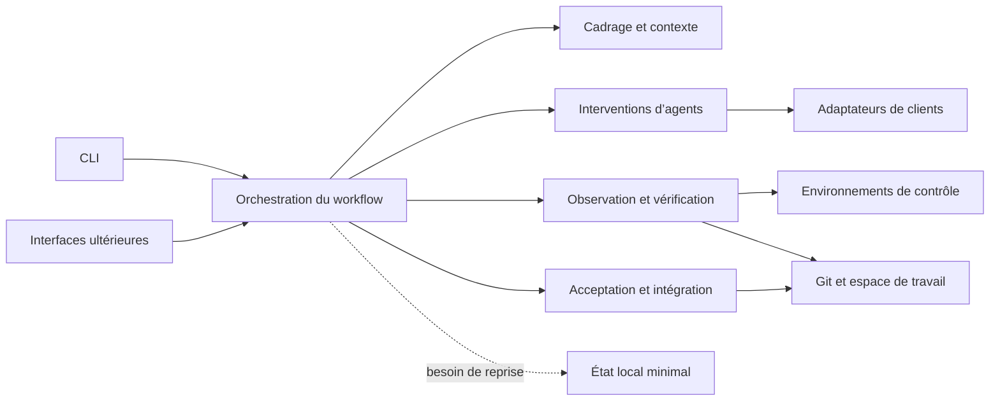
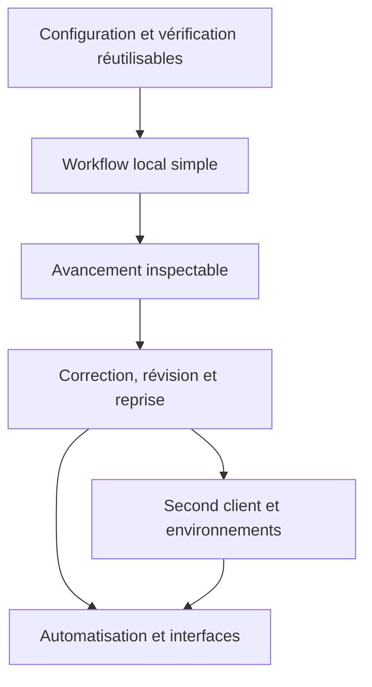

# Plan global d’évolution de 495

## Rôle du document

Ce document organise l’évolution de 495 depuis le parcours vertical disponible
vers le workflow complet décrit dans les
[parcours utilisateur](../parcours-utilisateur.md). Il indique les capacités à
rendre observables, leur ordre de dépendance et leurs effets attendus sur
l’architecture applicative.

Il ne remplace pas :

- les [principes et contraintes](../principes-et-contraintes.md), qui gouvernent
  les décisions techniques ;
- les [parcours utilisateur](../parcours-utilisateur.md), qui définissent les
  états, les gates et les usages visés ;
- l’[état de l’implémentation](../implementation.md), qui décrit exclusivement
  le comportement disponible.

Chaque incrément ci-dessous doit produire un résultat utilisable de bout en
bout. Son détail peut changer à la lumière d’un usage ou de l’état de l’art,
mais les propriétés déjà démontrées ne doivent pas être affaiblies
silencieusement.

## Point de départ

Ce plan part de l’état atteint par le premier parcours vertical. L’[état de
l’implémentation](../implementation.md) décrit ce qui est disponible depuis ;
la section ci-dessous n’est pas mise à jour à chaque incrément. À ce point de
départ, la commande `495` sait :

- recevoir une demande, un dépôt Git propre et un contrat de contrôles ;
- invoquer Codex CLI avec un environnement filtré ;
- valider la réponse structurée de l’agent ;
- identifier indépendamment le candidat produit ;
- exécuter séquentiellement les contrôles déclarés avec `codex sandbox` ;
- relier dans un résultat JSON la demande, l’état initial, le candidat et les
  diagnostics.

Sa [conception](00-parcours-vertical/conception.md) et son
[étude ciblée](00-parcours-vertical/etat-de-l-art.md) constituent le premier
chantier du dépôt. La comparaison des composants examinés est commune à tous
les incréments et vit dans l’[état de l’art](../etat-de-l-art.md).

Ce socle couvre une seule intervention entre `implementing` et `verifying`. Il
ne conduit pas encore le workflow, ne corrige pas un candidat défavorable, ne
reprend pas un travail interrompu et n’intègre pas le résultat.

Les limites techniques les plus proches de ce point de départ sont l’exigence
d’un dépôt initial propre, le support de Codex uniquement, l’absence de borne
propre sur les sorties de processus et des garanties de confinement encore
vérifiées principalement sur macOS. Le premier incrément lève la troisième.

## Cible fonctionnelle

Le parcours principal doit permettre à une personne de demander un changement
sans piloter elle-même une machine à états. 495 doit alors :

1. comprendre et préciser le besoin jusqu’à rendre ses exigences observables ;
2. concevoir une solution compatible avec le dépôt et préparer ses contrôles ;
3. faire produire un candidat avec les permissions et le contexte nécessaires ;
4. vérifier chaque exigence obligatoire avec un oracle adapté ;
5. corriger le candidat ou réviser une décision amont lorsqu’un écart le
   demande ;
6. faire accepter le candidat exact, automatiquement ou par une décision
   humaine explicite ;
7. intégrer ce candidat après l’autorisation nécessaire et vérifier le résultat
   intégré ;
8. expliquer tout arrêt, conserver les éléments nécessaires à une reprise et
   ne jamais masquer une exigence absente, en échec ou indéterminée.

Les parcours directs de configuration, de vérification d’un candidat existant,
de reprise et d’automatisation doivent composer les mêmes opérations. Ils ne
doivent pas maintenir leur propre interprétation des exigences, du candidat ou
des contrôles.

## Direction architecturale

495 reste un monolithe modulaire tant qu’un besoin de déploiement ne justifie
pas une séparation. Le workflow coordonne des opérations applicatives ; les
clients d’agents, Git et les environnements de contrôle restent des adaptateurs.

Cette direction entraîne les évolutions suivantes :

| Responsabilité | Point de départ | Évolution attendue |
| --- | --- | --- |
| Cas d’usage | `change.run_change` conduit une intervention complète | Extraire des opérations réutilisables de cadrage, tentative, vérification, décision et intégration, puis les coordonner dans un workflow. |
| État du changement | L’issue finale est calculée en mémoire | Représenter l’état courant, les transitions et les décisions de gate seulement lorsque le workflow les exécute réellement. |
| Exigences | Les contrôles du contrat forment l’unique feedback | Relier chaque exigence obligatoire à son statut et à un oracle exécutable, observable, de revue ou humain. |
| Contexte | Le client reçoit la demande et les instructions du dépôt | Construire un contexte propre à chaque intervention à partir des décisions encore valides et du dernier feedback. |
| Agents | `AgentClient` expose l’invocation nécessaire à Codex | Distinguer les opérations demandées et les capacités du client ; généraliser l’interface seulement lors de l’arrivée d’un second client. |
| Contrôles | `ControlRunner` exécute les commandes du contrat | En faire la frontière commune à la vérification directe et à la boucle de correction, sans dupliquer le runner. |
| Espace de travail | `workspace` exige un dépôt propre et observe un diff | Identifier plusieurs candidats successifs, vérifier leur stabilité et, si un usage l’exige, préparer un espace isolé. |
| Intégration | Absente | Ajouter une opération Git explicite et vérifier que sa destination contient exactement le candidat accepté. |
| Persistance | Aucun état applicatif n’est conservé | Introduire un état local versionné et atomique uniquement pour la reprise ; Git reste l’autorité sur les fichiers et l’historique. |
| Interfaces | Une commande produit un document JSON final | Stabiliser des opérations et des événements communs avant une CI, une TUI ou une interface web. |

Les schémas JSON sont versionnés aux frontières consommées par une machine. Les
objets internes peuvent évoluer avec les usages et n’ont pas à reproduire
chaque champ des réponses externes.

## Séquence d’évolution

### 1. Rendre la configuration et la vérification réutilisables

**Résultat utilisateur.** Un dépôt peut être préparé pour 495 puis un candidat
déjà présent peut être vérifié sans invoquer un agent.

**Fonctionnalités à ajouter.**

- proposer une configuration à partir des conventions et commandes détectées,
  puis la faire confirmer avant son enregistrement ;
- valider séparément la configuration, les commandes et les profils de
  permissions ;
- exposer une vérification directe qui accepte un état Git explicitement
  désigné et produit le même format de contrôle que le parcours avec agent ;
- distinguer l’absence de candidat, une configuration invalide et un contrôle
  défavorable dans les codes de sortie et le JSON ;
- borner la taille des sorties conservées tout en signalant leur troncature.

**Impact architectural.** La lecture du contrat, l’observation du candidat et
l’exécution des contrôles quittent le flux monolithique de `run_change` pour
devenir des opérations applicatives composables. La CLI gagne des commandes
orientées usage, tout en conservant l’invocation actuelle comme compatibilité.
Aucun stockage de workflow n’est nécessaire à ce stade.

La [conception de cet incrément](01-configuration-verification/conception.md)
fixe les commandes, les codes de sortie, les documents JSON et les
responsabilités extraites.

**Critères de fin.** Un projet cible indépendant de Python peut enregistrer sa
configuration, modifier un fichier et obtenir une vérification sans
authentification auprès d’un fournisseur d’IA. Les contrôles produisent le même
verdict et les mêmes diagnostics lorsqu’ils sont appelés seuls ou après une
intervention d’agent.

### 2. Faire traverser le workflow à un changement local simple

**Résultat utilisateur.** Une demande suffisamment claire progresse de
`clarifying` à `integrated`, ou s’arrête à la première gate qui exige une
information ou une autorisation absente.

**Fonctionnalités à ajouter.**

- exécuter `clarifying`, `specifying` et `designing` avec des réponses
  structurées adaptées à chaque décision ;
- représenter les exigences, leur caractère obligatoire, leur oracle et leur
  statut ;
- évaluer G0 à G4 à partir de faits observés plutôt que de la seule déclaration
  d’un agent ;
- construire le contexte de chaque intervention à partir de la demande, des
  décisions encore valides, des conventions du dépôt et des permissions ;
- effectuer une revue sémantique indépendante lorsque les contrôles
  exécutables ne couvrent pas une exigence ;
- accepter automatiquement un candidat lorsque toutes les exigences
  obligatoires sont satisfaites et qu’aucune décision humaine n’est requise ;
- exposer `StartIntegration`, réaliser une première intégration Git locale
  explicitement autorisée et vérifier G5 ;
- rendre une question bloquante ou un refus d’autorisation comme un arrêt
  normal et compréhensible, non comme un échec technique.

**Impact architectural.** Un coordinateur de workflow devient le point
d’entrée applicatif. Un modèle réduit porte le changement, l’état courant, les
exigences, les décisions de gate et l’identité du candidat. Les interventions
d’agent deviennent des opérations nommées avec un schéma de réponse propre à
leur consommation. Un assembleur de contexte sépare instructions, faits
observés et contenu non fiable. Une frontière d’intégration Git complète
l’observation déjà fournie par `workspace`.

Le premier parcours ininterrompu peut rester en mémoire. Il ne justifie ni bus
d’événements, ni base de données, ni classe distincte pour chaque état.

**Critères de fin.** Une démonstration réelle relie la demande initiale aux
exigences, aux décisions, au candidat vérifié, à son acceptation et au résultat
Git intégré. Une ambiguïté matérielle et une intégration non autorisée arrêtent
chacune le parcours au bon endroit sans modifier la destination.

### 3. Rendre l’avancement et les décisions inspectables

**Résultat utilisateur.** La personne comprend ce que 495 fait, pourquoi le
workflow avance ou s’arrête et quelle action est attendue, sans devoir lire les
sorties brutes des outils.

**Fonctionnalités à ajouter.**

- afficher les états, gates, interventions, contrôles et décisions au fil de
  l’exécution ;
- proposer une sortie humaine concise et une sortie JSON stable pour
  l’automatisation ;
- relier chaque résultat au digest du candidat auquel il s’applique ;
- présenter les questions, exigences indéterminées, autorisations attendues et
  limites séparément des erreurs techniques ;
- produire un rapport partageable uniquement sur demande, avec les
  diagnostics sensibles clairement signalés.

**Impact architectural.** Le coordinateur publie un vocabulaire minimal
d’événements applicatifs sans en faire une source d’état. La CLI transforme ces
événements pour l’affichage et sérialise le résultat final ; elle ne recalcule
aucune décision de workflow. Les sorties brutes restent attachées aux
interventions ou aux contrôles qui les ont produites.

**Critères de fin.** Un humain et une CI peuvent expliquer le même arrêt à
partir des mêmes données. Aucun ancien verdict n’est présenté comme applicable
après une modification du candidat.

### 4. Corriger, réviser et reprendre

**Résultat utilisateur.** Un résultat défavorable alimente une nouvelle
tentative et un travail interrompu peut reprendre sans perdre les décisions
encore valides.

**Fonctionnalités à ajouter.**

- transformer les échecs de commandes et constats de revue en feedback ciblé ;
- appliquer `StartAttempt` lorsque la conception reste valable ;
- appliquer `ReviseIncrement` lorsqu’une hypothèse amont change et invalider
  explicitement les décisions qui en dépendent ;
- distinguer chaque candidat et chaque ensemble de contrôles dans une suite de
  tentatives ;
- permettre une limite de coût, de durée ou de tentatives lorsqu’une exécution
  autonome la demande ;
- reprendre un dépôt déjà modifié ou une exécution interrompue après avoir
  expliqué l’état reconnu et les suites compatibles ;
- abandonner ou remplacer un candidat sans supprimer silencieusement le travail
  local.

**Impact architectural.** Le coordinateur applique des transitions explicites
et reconstruit le contexte depuis les décisions valides. Une entité de
tentative relie entrée, candidat, feedback et verdict. Un stockage local
minimal, versionné et écrit atomiquement apparaît si Git et les fichiers du
projet ne suffisent pas à reconstituer la reprise. Ce stockage référence les
commits et digests ; il ne copie pas l’historique Git et ne devient pas un
journal exhaustif des appels de modèles.

**Critères de fin.** Un contrôle défavorable peut conduire à un nouveau
candidat vérifié sans réinterpréter silencieusement la demande. Une révision de
conception invalide les décisions aval concernées. Une interruption après
n’importe quelle gate reprise par le scénario conserve le même sens et ne
réutilise aucun résultat obsolète.

### 5. Éprouver plusieurs capacités d’agents et d’exécution

**Résultat utilisateur.** Un projet peut choisir un second client d’agent ou un
environnement adapté sans changer le sens du workflow.

**Fonctionnalités à ajouter.**

- intégrer un second client réel à partir d’un parcours déjà couvert, notamment
  Claude Code si ses garanties satisfont le besoin retenu ;
- détecter les capacités utiles : sortie structurée, reprise de session,
  outils, hooks, permissions et confinement ;
- refuser avant exécution une opération dont les garanties requises ne peuvent
  pas être appliquées ;
- sélectionner des profils de fichiers, réseau, environnement et secrets selon
  l’intervention ;
- qualifier le confinement sur Linux et les autres environnements réellement
  pris en charge.

**Impact architectural.** `AgentClient` évolue à partir des différences
observées entre deux intégrations. Les contrats logiques des opérations restent
dans l’application ; chaque adaptateur traduit commandes, événements et
permissions du fournisseur. La sélection de l’environnement d’exécution est
une composition explicite, pas une condition dispersée dans le workflow.

Une sandbox propre à 495, un conteneur ou une exécution distante ne sont
introduits que si les runtimes disponibles ne satisfont pas une politique
requise. Leur choix doit être précédé de l’étude et des essais imposés par les
principes du projet. L’[état de l’art](../etat-de-l-art.md) compare déjà
Claude Code, son mode non interactif, sa sandbox et
`@anthropic-ai/sandbox-runtime` ; cet incrément éprouve ces propriétés au lieu
de reprendre la comparaison à zéro.

**Critères de fin.** Le même scénario fonctionnel passe avec deux clients réels
et donne les mêmes décisions de workflow. Les différences de capacités sont
visibles et un manque de garantie produit une impossibilité explicite, jamais
une dégradation silencieuse.

### 6. Ouvrir l’automatisation et les interfaces enrichies

**Résultat utilisateur.** Le workflow stable peut être exécuté sans interaction
en CI et piloté par une interface interactive sans divergence fonctionnelle.

**Fonctionnalités à ajouter.**

- fournir un mode non interactif qui échoue lorsqu’une décision humaine est
  requise et retourne un résultat structuré exploitable en CI ;
- ajouter l’annulation, la reprise et le suivi adaptés aux exécutions longues ;
- proposer ensuite une TUI ou une interface web pour répondre aux questions,
  examiner le diff, les preuves et autoriser l’intégration ;
- permettre la conservation et le partage explicites d’un résultat ;
- ajouter des intégrations propres aux plateformes seulement lorsqu’elles
  simplifient un usage réel.

**Impact architectural.** Les interfaces utilisent les mêmes opérations et le
même état de workflow. Un flux d’événements stable alimente l’affichage et
l’automatisation. Une base transactionnelle, une file de travaux ou un service
séparé n’apparaissent que si la concurrence, la durée des traitements ou le
déploiement multi-utilisateur les rendent nécessaires.

**Critères de fin.** Un scénario produit la même décision depuis la CLI locale,
le mode non interactif et l’interface retenue. Aucune interface ne peut
contourner une gate, modifier une autorisation ou accepter un autre candidat
que celui observé par le noyau applicatif.

## Travaux transversaux

Ces propriétés accompagnent chaque incrément concerné au lieu de former une
séquence indépendante.

### Sécurité et confinement

- tester les refus de lecture, d’écriture, de réseau et de transmission de
  secrets, ainsi que leur héritage par les processus enfants ;
- annoncer avant exécution tout besoin de réseau, secret ou service tiers ;
- distinguer les permissions demandées, accordées et effectivement vérifiées ;
- conserver les diagnostics localement par défaut et éviter d’y recopier des
  secrets connus ;
- documenter les limites par plateforme sans revendiquer une herméticité non
  démontrée.

### Robustesse opérationnelle

- borner durée, volume de sortie et nombre d’essais lorsque le parcours le
  nécessite ;
- terminer les groupes de processus et rendre les annulations explicites ;
- écrire atomiquement tout état destiné à la reprise ;
- faire évoluer les formats persistés et les schémas JSON avec une version et
  des erreurs de compatibilité compréhensibles.

### Qualité et validation

- couvrir les règles du workflow et les échecs avec des doubles
  déterministes ;
- conserver un essai de bout en bout par client et plateforme revendiqués ;
- tester qu’un changement de candidat invalide les contrôles, revues et
  acceptations antérieurs ;
- vérifier séparément les profils de confinement et le comportement
  fonctionnel ;
- mettre à jour l’état de l’implémentation à chaque capacité réellement livrée.

### Coût et performance

- mesurer le temps, les appels d’agents et l’usage annoncé sans promettre un
  coût exact lorsqu’il dépend du fournisseur ;
- sélectionner le contexte selon la décision courante et non par copie
  systématique de l’historique ;
- paralléliser des contrôles seulement si leur indépendance et la stabilité du
  candidat restent garanties.

## Dépendances entre les incréments

La sécurité, la robustesse et la validation s’appliquent le long de cette
chaîne. Une capacité peut être avancée lorsqu’elle débloque un usage concret,
mais elle ne doit pas créer une seconde autorité sur le workflow ou le
candidat.

## Décisions volontairement différées

Le plan ne rend pas obligatoires avant leur usage :

- une base de données, un journal d’événements ou une provenance exhaustive ;
- une architecture distribuée ou un service permanent ;
- une sandbox développée par 495 ;
- un checkout isolé pour toute intervention ;
- une abstraction universelle couvrant tous les agents ;
- une découverte automatique et silencieuse des critères métier ;
- une TUI et une interface web simultanées ;
- la publication distante, la création de pull requests ou l’intégration à une
  forge particulière.

Chacune de ces décisions doit partir d’un parcours observable, comparer les
solutions maintenues disponibles et préciser le coût de la garantie recherchée.

## Définition d’achèvement globale

La cible principale est atteinte lorsqu’une demande réelle peut traverser le
workflow complet avec les propriétés suivantes :

- chaque gate repose sur des faits, des oracles ou une décision humaine
  identifiés ;
- chaque intervention reçoit un contexte et des permissions adaptés ;
- chaque verdict, revue et acceptation désigne le candidat exact concerné ;
- un échec déclenche une correction, une révision ou un arrêt explicite ;
- une interruption peut être reprise sans réutiliser une décision invalidée ;
- l’intégration nécessite l’autorisation applicable et G5 observe sa
  destination ;
- les interfaces partagent le même comportement applicatif ;
- la documentation distingue précisément ce qui est disponible, vérifié,
  conditionnel et absent.
