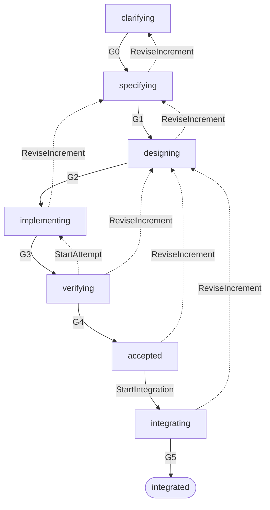

# Parcours utilisateur de 495

## Objet

Ce document décrit les résultats que 495 doit rendre possibles avant de fixer
ses commandes, son modèle de données ou ses intégrations. Ces parcours
s’inscrivent dans un workflow de référence commun.

La promesse centrale est la suivante : une personne doit pouvoir relier une
demande, les modifications qui prétendent y répondre et les contrôles exécutés
sur ces modifications, puis décider de la suite en connaissance de cause.

## Positionnement

495 est un harnais d’agents de code qui automatise autant que possible le
workflow d’un changement logiciel. Codex, Claude Code ou un agent local doivent
pouvoir participer à toutes les étapes pour lesquelles ils disposent des
capacités nécessaires : analyser le dépôt, clarifier, rédiger, concevoir,
modifier, contrôler, relire et préparer l’intégration.

495 et l’application cible sont deux systèmes distincts. 495 possède son propre
code, ses adaptateurs et ses dépendances ; l’application cible conserve ses
langages, frameworks, conventions, architecture et chaîne de développement.
Les parcours ci-dessous décrivent comment 495 agit sur cette application sans
lui imposer les choix techniques du harnais.

Le harnais combine deux familles de contrôles. Le *feedforward* construit la
tentative : objectif, contraintes, contexte sélectionné, outils, permissions et
forme du résultat. Le *feedback* observe ce que l’agent et ses outils ont
effectivement produit, puis transforme les écarts en diagnostics assez précis
pour guider la correction suivante.

La boucle `implementing`–`verifying` reprend les comportements expérimentés
dans [CodeServo](reprise-de-codeservo.md). 495 les simplifie et les compose avec
les étapes amont et aval au lieu de construire un second système autour d’eux.

L’utilisateur entre dans le parcours en exprimant son besoin. 495 crée le
changement correspondant et lance immédiatement `clarifying`. Il poursuit
automatiquement tant que les conditions de passage sont satisfaites. Il rend
la main lorsqu’une décision ne peut pas être déduite du besoin, lorsqu’une
exigence obligatoire reste indéterminée ou lorsqu’un effet exige une
autorisation humaine.

L’objectif n’est donc pas de demander à l’utilisateur de piloter chaque état.
Les états et gates structurent l’automatisation, rendent l’avancement
compréhensible et indiquent précisément pourquoi le workflow avance ou
s’arrête.

## Workflow de référence

Le cycle d’un changement constitue la colonne vertébrale de 495 :

Les états et passages ont un sens fonctionnel stable :

| Élément | Signification |
| --- | --- |
| `clarifying` | Comprendre l’objectif, le périmètre et les questions qui empêchent d’avancer. |
| G0 | Le besoin est assez clair pour être spécifié. |
| `specifying` | Décrire les comportements attendus, les contraintes et les critères observables. |
| G1 | La spécification est utilisable pour concevoir une solution. |
| `designing` | Choisir une solution, ses impacts et la manière de la contrôler. |
| G2 | La conception fournit assez d’informations pour modifier le projet. |
| `implementing` | Produire le code, les tests et la documentation nécessaires. |
| G3 | Un candidat identifiable est prêt à être vérifié. |
| `verifying` | Exécuter les contrôles et examiner le candidat. |
| G4 | Le candidat vérifié est accepté pour le périmètre demandé. |
| `accepted` | Le candidat exact est prêt à être intégré. |
| `StartIntegration` | Le déclenchement explicite d’un effet d’intégration. |
| `integrating` | L’intégration est en cours ou doit être réconciliée. |
| G5 | Le résultat intégré correspond au candidat accepté. |
| `integrated` | Le changement est présent dans sa destination. |

`StartAttempt` relance l’implémentation sans modifier le besoin, la
spécification ni la conception. `ReviseIncrement` indique au contraire qu’une
hypothèse amont change ; les décisions qui en dépendent doivent alors être
réexaminées.

Ce workflow n’impose pas une interface ou un artefact distinct pour chaque
état. Un changement simple peut traverser rapidement plusieurs passages dans
une même interaction. Les gates restent des décisions observables, mais leur
mécanisme doit être proportionné au risque : une confirmation ou un résultat
de commande peut suffire.

## Couverture des exigences

Les gates couvrent plusieurs niveaux d’exigences :

| Gate | Niveau principalement contrôlé |
| --- | --- |
| G0 | Intention, objectif, périmètre et questions bloquantes. |
| G1 | Comportements attendus, contraintes fonctionnelles et non fonctionnelles, critères observables. |
| G2 | Conception, conventions de la base de code, impacts, stratégie de contrôle et capacités nécessaires. |
| G3 | Contenu et recevabilité du candidat produit. |
| G4 | Résultats des contrôles, conformité aux exigences et limites restantes. |
| G5 | Correspondance entre le candidat accepté et le résultat intégré. |

495 garantit qu’une exigence déclarée obligatoire n’est pas ignorée : elle doit
être satisfaite par une preuve adaptée, démontrée en échec ou signalée comme
indéterminée. Une gate ne réussit que si toutes ses exigences obligatoires sont
satisfaites.

Cette garantie porte sur l’application des exigences connues. Elle ne prouve
pas que leur ensemble exprime parfaitement le besoin réel. Les agents peuvent
chercher les omissions et contradictions ; une ambiguïté métier irréductible
reste une question pour l’utilisateur.

Une déclaration de réussite produite par l’agent n’est pas, à elle seule, une
preuve. Selon l’exigence, l’oracle peut être une commande exécutable, une
inspection structurée, une observation de l’environnement ou une décision
humaine explicite.

## Agents et outils

495 peut mobiliser les moyens disponibles dans l’environnement de chaque
agent :

- prompts adaptés à l’état courant et au dépôt cible ;
- skills spécialisés et instructions propres au projet ;
- outils de lecture, d’édition, de recherche, de test et d’intégration ;
- hooks déclenchés avant ou après une action ou un passage de gate ;
- agents distincts pour produire, contrôler ou relire lorsque cette séparation
  améliore réellement la confiance.

495 sélectionne et transmet le contexte nécessaire, suit les opérations et
normalise leurs résultats. Il respecte les permissions de l’environnement et
ne transforme pas la disponibilité d’un outil en autorisation de l’utiliser.

### Construire le contexte (*context engineering*)

Le contexte est un contrôle du comportement, pas un simple remplissage de la
fenêtre du modèle. Pour chaque intervention, 495 part de l’état courant et
assemble seulement les éléments utiles : demande, exigences, décisions encore
valides, extraits du dépôt, conventions, outils autorisés et feedback de la
tentative précédente.

Limiter le contexte ne signifie pas rechercher le moins de jetons possible. Une
information nécessaire à une décision correcte doit être présente ; un fichier,
un historique, une instruction ou un secret sans rapport doit rester absent.
La sélection, l’ordre et la formulation influencent les décisions de l’agent :
495 distingue donc les instructions, les faits observés et les contenus non
fiables, et rend visibles les hypothèses ou omissions matérielles.

### Confiner l’exécution

Chaque agent et les processus qu’il lance s’exécutent dans une sandbox. Son
profil accorde explicitement les fichiers, commandes, variables, secrets et
accès réseau requis par l’intervention. Le reste n’est pas accessible. Une
liste de fichiers modifiés calculée après l’exécution permet d’expliquer le
résultat, mais ne remplace pas ce confinement préventif.

Le mécanisme reste propre à la plateforme. Sous Linux, les candidats à évaluer
incluent [Bubblewrap](https://github.com/containers/bubblewrap), les namespaces
du noyau et [Landlock](https://docs.kernel.org/userspace-api/landlock.html).
[seccomp](https://docs.kernel.org/userspace-api/seccomp_filter.html) complète
ces mécanismes en filtrant les appels système ; il ne remplace pas à lui seul
la politique portant sur les fichiers, les processus, le réseau et les secrets.
L’étude doit donc comparer des assemblages comme Bubblewrap avec seccomp ou
Landlock avec seccomp, ainsi que leur compatibilité avec les chaînes d’outils
des projets cibles.

Sous macOS, la sandbox du système couramment appelée Seatbelt fait partie des
mécanismes à évaluer. `sandbox-exec` permet encore de lui fournir un profil,
mais cet outil est déprécié par sa page de manuel ; il peut servir à un
prototype sans constituer le choix durable par défaut. L’étude doit aussi
examiner les interfaces macOS prises en charge et, si elles ne conviennent pas
à un agent en ligne de commande, l’isolation par conteneur ou machine virtuelle.

Une sandbox retenue doit notamment être testée sur les lectures et écritures
interdites, l’accès réseau, la transmission des secrets, les appels système
sensibles et l’héritage des restrictions par les processus enfants.

### Structurer le résultat

La réponse qu’un agent remet à 495 est un document JSON conforme à un JSON
Schema connu de l’opération. Le schéma décrit uniquement ce que l’orchestrateur
doit interpréter, par exemple le statut, les questions bloquantes, les
diagnostics, les fichiers concernés et la suite proposée. Il ne cherche ni à
capturer un raisonnement interne, ni à convertir les sorties brutes des outils.

Cette frontière structurée est utile parce qu’une décision de workflow ne doit
pas dépendre de l’analyse fragile d’une prose libre. 495 utilise la production
contrainte d’un fournisseur lorsqu’elle existe et valide toujours le document
reçu. Une réponse invalide entraîne une correction bornée ou un échec technique
explicite ; elle n’est pas interprétée silencieusement.

### Produire un feedback exploitable

Pendant `implementing` et `verifying`, 495 privilégie les oracles déjà
reconnus par le projet cible. Selon sa chaîne d’outils, le feedback peut venir :

- du compilateur ou du système de build ;
- des linters, formateurs et analyseurs statiques ;
- du vérificateur de types ;
- des diagnostics et fonctions de navigation d’un serveur LSP ;
- des suites de tests ;
- de la couverture de tests et des tests de mutation ;
- d’une observation fonctionnelle ou d’une revue sémantique.

495 n’impose pas tous ces contrôles à chaque projet. Il choisit ceux qui
mesurent les exigences applicables, conserve leur diagnostic utile et le relie
au candidat observé. Le prochain essai reçoit l’écart à corriger plutôt qu’un
simple verdict favorable ou défavorable.

La première implémentation doit intégrer un agent réel. Une interface commune
à plusieurs agents sera extraite à partir de cette intégration, puis éprouvée
avec un second agent, au lieu de définir à l’avance un protocole exhaustif.

## Acteurs

Quatre rôles suffisent pour décrire les usages envisagés :

- l’**utilisateur** exprime le besoin, répond aux arbitrages qui lui reviennent
  et autorise les effets qui l’exigent ;
- l’**agent** produit ou analyse des éléments du changement avec les outils qui
  lui sont accessibles ;
- le **relecteur** examine le résultat et décide de le conserver, de le faire
  corriger ou de l’écarter ;
- l’**automatisation** exécute les mêmes contrôles sans interaction humaine,
  par exemple dans une intégration continue.

L’utilisateur peut aussi être relecteur. Un agent peut effectuer une revue ou
proposer une décision, mais il ne peut pas déclarer seul satisfaite une
exigence dont il est également l’unique source de preuve.

## Premier incrément vertical

Cette section spécifie la prochaine capacité à implémenter. Elle ne décrit pas
un comportement actuellement disponible et ne suppose pas que 495 exécute déjà
les états ou les gates du workflow de référence.

### Résultat recherché

Depuis un dépôt applicatif local, un utilisateur confie une demande de
modification à 495. Le harnais invoque un véritable client d’agent de code,
identifie le candidat produit, exécute les contrôles déclarés par l’application
cible et restitue un résultat qui relie la demande, le candidat et les
observations.

Ce premier parcours rend observable une chaîne complète
`demande → agent → candidat → contrôles → résultat`. Il ne cherche pas encore à
automatiser la clarification, la conception, la correction ou l’intégration.

### Préconditions

- l’application cible est un dépôt Git local dont l’état initial est propre ;
- un client d’agent pris en charge est installé, configuré et authentifié ;
- au moins une commande de contrôle est déclarée par l’application cible ;
- l’utilisateur a autorisé les modifications locales demandées ;
- les permissions nécessaires à l’agent et aux contrôles peuvent être exprimées
  et appliquées par leurs environnements d’exécution.

Un prérequis absent produit un diagnostic avant l’invocation de l’agent. 495 ne
modifie pas silencieusement le dépôt pour fabriquer ces préconditions.

### Parcours exact

1. L’utilisateur fournit la demande et désigne le dépôt cible.
2. 495 vérifie les préconditions, relève l’identité de l’état initial et
   indique le client, les permissions et les contrôles qui seront utilisés.
3. 495 construit l’entrée de l’agent à partir de la demande, des instructions
   applicables au dépôt et des seules informations nécessaires à cette
   intervention.
4. 495 invoque le client réel dans une sandbox avec les permissions annoncées.
   Le confinement de cette intervention peut être délégué au client si son
   comportement satisfait la politique attendue.
5. Le client peut modifier le dépôt. Sa réponse destinée à 495 est validée par
   un JSON Schema minimal qui porte seulement le statut, le résumé et les
   éventuelles questions ou limites que le harnais doit interpréter.
6. 495 observe le dépôt après l’intervention et identifie le candidat par
   rapport à l’état initial. L’identité du candidat ne repose pas sur la seule
   déclaration de l’agent.
7. Si un candidat existe, 495 exécute une fois chaque contrôle configuré sur ce
   candidat, dans un environnement appliquant les permissions annoncées, et
   recueille son code de sortie, sa durée, son éventuel timeout et ses
   diagnostics utiles. La sandbox du client ne couvre cette exécution que si
   les contrôles sont effectivement lancés sous la même garantie.
8. 495 restitue l’issue, l’identité du candidat, les fichiers modifiés, la
   réponse structurée de l’agent, les contrôles exécutés et les limites du
   résultat. Il laisse le candidat localement inspectable.

### Issues observables

- **Candidat vérifié** : un candidat identifiable existe et tous les contrôles
  configurés réussissent.
- **Candidat en échec** : le candidat reste inspectable et chaque contrôle
  défavorable fournit son diagnostic ; 495 ne présente pas cet état comme une
  réussite.
- **Échec de l’agent** : l’absence de candidat, l’échec du client ou une réponse
  JSON invalide est distingué d’un échec des contrôles applicatifs.
- **Exécution impossible** : une précondition, une permission ou une capacité
  manque ; aucun résultat ambigu n’est produit.

Le premier incrément effectue une seule intervention d’agent. En cas d’échec,
il fournit les éléments nécessaires à une correction, mais ne relance pas
encore automatiquement l’agent.

### Répartition des responsabilités

495 construit l’entrée, invoque le client, observe le candidat, déclenche les
contrôles et compose le résultat. Il reste responsable de vérifier qu’une
politique de confinement s’applique à chaque processus qu’il déclenche, sans
nécessairement implémenter lui-même cette politique. Le client d’agent gère
l’accès au modèle, ses outils et, lorsque ses garanties conviennent, le
confinement de son exécution. L’application cible reste l’autorité sur ses
instructions, ses langages, ses dépendances et ses commandes de contrôle.

### Critères d’acceptation

Le parcours est accepté lorsqu’une démonstration de bout en bout établit que :

1. une demande réelle est transmise à un client d’agent pris en charge ;
2. le contexte transmis exclut les informations sans rapport identifiées par
   le scénario de démonstration ;
3. les permissions effectives de l’agent et des contrôles correspondent à
   celles annoncées ;
4. une réponse conforme au schéma est acceptée et une réponse non conforme
   produit un échec explicite ;
5. les modifications observées sont reliées à l’état initial du dépôt sans se
   fier au résumé de l’agent ;
6. les commandes du projet cible sont exécutées sur ce candidat, quel que soit
   le langage employé par ce projet ;
7. un contrôle favorable et un contrôle défavorable donnent les deux issues
   attendues avec leurs diagnostics ;
8. un timeout ou un échec du client ne peut pas être confondu avec un candidat
   vérifié ;
9. aucun commit, publication ou autre effet externe n’est effectué sans une
   demande distincte.

Les tests automatisés peuvent remplacer le client par un double pour provoquer
les erreurs difficiles à reproduire, mais l’acceptation du parcours exige aussi
au moins une exécution de bout en bout avec le véritable client retenu.

### Hors périmètre

Cet incrément ne comprend pas encore :

- l’exécution automatique de `clarifying`, `specifying`, `designing` ou de
  leurs gates ;
- une boucle automatique de correction à partir du feedback ;
- plusieurs clients, plusieurs agents ou une abstraction générale de leurs
  capacités ;
- la découverte automatique des contrôles de l’application cible ;
- la prise en charge d’un dépôt initialement modifié ou la reprise d’une
  exécution interrompue ;
- la revue, l’acceptation, le commit, l’intégration ou la publication du
  candidat ;
- une sandbox construite par 495 lorsque les environnements retenus couvrent
  déjà l’agent et les contrôles avec les propriétés requises ;
- une TUI, une interface web, une intégration CI ou un historique persistant.

## Parcours principal : apporter un changement

**Situation.** L’utilisateur veut obtenir un changement dans sa base de code,
pas administrer un workflow.

**Parcours.**

1. L’utilisateur décrit le résultat souhaité et, s’il les connaît déjà, ses
   contraintes ou autorisations particulières.
2. 495 crée le changement en `clarifying` et confie à un agent l’inspection du
   dépôt, la recherche des ambiguïtés et la préparation de G0.
3. Les agents font progresser automatiquement la spécification et la conception
   jusqu’à G2. 495 sollicite l’utilisateur seulement lorsqu’un choix ayant un
   impact matériel ne peut pas être déduit.
4. Un agent réalise le changement dans une sandbox, à partir du contexte et des
   permissions préparés pour `implementing`. Le candidat franchit G3 lorsqu’il
   est identifiable et vérifiable.
5. Les contrôles exécutables et les revues adaptées évaluent toutes les
   exigences obligatoires. Un échec déclenche une correction ou une révision ;
   un résultat suffisant permet de franchir G4.
6. 495 déclenche ou propose l’intégration selon les autorisations disponibles,
   puis vérifie G5.
7. L’utilisateur reçoit le résultat, les changements produits, les preuves
   utiles et les limites restantes.

**Résultat observable.** Le changement est `integrated`, ou le workflow est
arrêté dans un état explicite avec sa cause et l’action attendue. Une exécution
autonome ne masque jamais une exigence non satisfaite pour atteindre l’état
final.

## Parcours composables et entrées directes

### Configurer un projet

**Situation.** Un utilisateur veut utiliser 495 dans un dépôt existant.

**Parcours.** 495 demande à un agent d’inspecter le dépôt et de proposer les
fichiers pertinents, les conventions applicables et les commandes qui
constatent que le projet fonctionne. L’utilisateur corrige cette proposition
si nécessaire. 495 vérifie que la configuration est exécutable et
l’enregistre dans le dépôt sous une forme lisible.

**Résultat observable.** Une autre personne peut cloner le dépôt, lire la
configuration et lancer les mêmes contrôles.

**Limites.** 495 ne doit pas inventer silencieusement les critères métier. Les
agents peuvent proposer des commandes détectées dans le projet, mais
l’utilisateur reste responsable de leur pertinence.

### Cadrer une modification

**Situation.** L’utilisateur formule un besoin, plus ou moins précis.

**Parcours.** 495 lance `clarifying`. Un ou plusieurs agents inspectent la base
de code, explicitent l’objectif et les inconnues, rendent le résultat attendu
observable, puis proposent une solution suffisamment précise pour agir. Ce
parcours couvre `clarifying`, `specifying` et `designing`, avec G0, G1 et G2.

**Résultat observable.** L’utilisateur et les agents partagent une compréhension
suffisante du changement, de ses limites et de ses contrôles avant de modifier
le projet.

495 ne rend pas obligatoires trois documents ni trois validations manuelles.
Pour une correction évidente, la demande, le diagnostic et les conventions du
dépôt peuvent constituer les informations nécessaires. Une ambiguïté ayant un
impact matériel exige en revanche une décision explicite.

### Vérifier une modification existante

**Situation.** Du code a déjà été modifié, par une personne ou par un agent.

**Parcours.** L’utilisateur demande à 495 de vérifier l’état courant. 495
identifie le contenu considéré, exécute les contrôles configurés et présente
leur résultat.

**Résultat observable.** L’utilisateur sait quels fichiers et quelles
commandes sont couverts, ce qui a réussi ou échoué et quelles limites restent
hors contrôle.

Ce parcours ne dépend d’aucun fournisseur d’IA et correspond au comportement
utile du lanceur actuel. C’est une entrée directe utile, mais pas le parcours
principal du produit.
Lorsqu’il commence avec un candidat existant, 495 doit recueillir le minimum
d’informations amont nécessaire pour que G3 et G4 conservent un sens.

### Faire réaliser une modification

**Situation.** G2 autorise la réalisation du changement demandé.

**Parcours.** 495 construit le contexte nécessaire à partir de la demande, de
la spécification, de la conception et du dernier feedback. Il lance l’agent et
ses outils dans une sandbox adaptée aux permissions accordées, valide sa réponse
JSON, puis présente le candidat à G3 avant sa vérification. Une question
n’interrompt le travail que si une réponse est nécessaire pour éviter un
résultat matériellement différent de l’intention exprimée.

**Résultat observable.** Le dépôt contient un candidat inspectable accompagné
du résultat des contrôles. Les effets externes ou difficiles à inverser restent
soumis à une confirmation distincte.

Ce parcours porte la valeur complète de 495, mais exige une première
intégration réelle avec un agent. Il doit réutiliser le parcours de vérification
au lieu de posséder son propre système de contrôles.

### Examiner et décider

**Situation.** Un candidat et ses résultats sont disponibles.

**Parcours.** Un agent de revue et, lorsque la politique du projet l’exige, un
relecteur humain consultent la demande initiale, les fichiers modifiés, le
diff, les contrôles exécutés et les limites signalées. G4 est franchie
automatiquement lorsque toutes les exigences obligatoires sont satisfaites et
qu’aucune décision humaine n’est requise. Sinon, 495 demande l’arbitrage
manquant.

**Résultat observable.** La décision s’applique au contenu effectivement
examiné. Une modification ultérieure rend naturellement l’ancien résultat
obsolète.

495 n’a pas besoin d’un registre d’approbations ni d’un mécanisme de signature
pour rendre ce parcours utile. La décision et les preuves qui lui sont
nécessaires doivent toutefois rester reliées au candidat examiné.

### Intégrer le candidat accepté

**Situation.** Le candidat exact a franchi G4.

**Parcours.** 495 déclenche l’intégration dès qu’elle est autorisée, ou demande
la confirmation nécessaire si cet effet n’était pas couvert par la demande
initiale. Il observe le résultat et ne franchit G5 que si la destination
contient le candidat accepté.

**Résultat observable.** Le changement atteint `integrated`, ou reste dans
`integrating` avec un écart compréhensible et une action de reprise possible.

Au départ, 495 peut piloter les commandes Git déjà disponibles sans remplacer
Git comme source d’historique.

### Corriger après un résultat défavorable

**Situation.** Un contrôle échoue ou le relecteur identifie un écart.

**Parcours.** 495 transforme le diagnostic disponible en feedback ciblé pour
l’agent. Il utilise `StartAttempt` si la conception reste valable, ou
`ReviseIncrement` si une décision amont change, puis reconstruit le contexte et
relance la vérification sur le nouvel état.

**Résultat observable.** Chaque résultat indique clairement le contenu auquel
il se rapporte. 495 ne choisit pas une exécution favorable parmi plusieurs et
ne présente pas un ancien succès comme applicable au nouveau candidat.

Une limite de tentatives ou de coût peut être ajoutée lorsqu’un usage autonome
la réclame. Elle n’est pas nécessaire à la boucle locale interactive.

## Parcours de soutien

### Reprendre un travail interrompu

495 reconnaît la configuration et les modifications déjà présentes dans le
dépôt. Il explique ce qu’il peut reprendre et demande une décision seulement
si plusieurs suites incompatibles sont possibles. Une base de données, un
journal d’événements ou un protocole de reprise ne sont pas nécessaires tant
que Git et les fichiers locaux suffisent.

### Exécuter les contrôles en automatisation

Une CI lance la vérification sans interaction, reçoit un code de sortie fiable
et peut demander un résultat structuré. Le comportement fonctionnel doit rester
le même que lors d’une exécution locale. L’intégration propre à une plateforme
de CI est une commodité ultérieure, pas une condition du noyau.

### Conserver ou partager un résultat

L’utilisateur demande explicitement un rapport lorsqu’il doit transmettre ou
archiver les faits d’une exécution. Le rapport identifie son contenu et ses
commandes, mais ne devient ni une preuve de sécurité ni une seconde source
d’historique concurrente de Git et de la CI.

### Changer d’agent ou d’environnement d’exécution

L’utilisateur peut choisir une autre capacité d’agent ou un environnement
distant lorsque le projet l’exige. Ce parcours ne justifie une abstraction
commune qu’après l’intégration réussie d’un premier fournisseur et l’apparition
d’un second besoin concret.

## Interaction utilisateur et interfaces

Le parcours principal commence par une action orientée vers le résultat :
« apporter ce changement à ma base de code ». L’interface ne doit pas demander
à l’utilisateur de manipuler directement une machine à états pour accomplir
une tâche ordinaire.

Elle doit principalement permettre de :

- décrire un changement ;
- répondre à une question réellement bloquante ;
- suivre l’avancement et comprendre un arrêt ;
- examiner le candidat et ses preuves ;
- demander une correction ou une révision ;
- autoriser un effet externe et intégrer le résultat.

Les états, gates, agents actifs et exigences restent visibles pour expliquer le
comportement de 495, sans devenir une succession de formulaires imposés.

Une CLI fournit la première interface automatisable. Une TUI ou une interface
web pourra ensuite offrir une interaction plus riche. Toutes doivent invoquer
les mêmes opérations et observer le même état du workflow ; aucune interface
ne maintient sa propre interprétation du changement.

## Responsabilités laissées aux outils existants

495 ne doit pas, par défaut :

- imposer à l’application cible le langage, les dépendances ou l’architecture
  utilisés pour construire 495 ;
- remplacer Git pour créer des branches, conserver l’historique, fusionner ou
  publier des modifications ;
- remplacer le gestionnaire de paquets, le runner de tests ou le système de
  build du projet cible ;
- remplacer une interface générale de discussion ou d’analyse lorsqu’aucune
  modification ni vérification n’est demandée ;
- décider qu’un besoin métier est correct à la place du relecteur ;
- authentifier une identité humaine ou produire une preuve opposable ;
- étendre son workflow de référence à une méthodologie universelle imposée à
  tous les projets ;
- conserver tous les échanges avec l’agent ou toutes les exécutions passées.

495 peut appeler ces outils et rendre leurs résultats compréhensibles. Il ne
duplique leur état que lorsqu’un parcours observable l’exige.

## Ordre recommandé

L’implémentation devrait progresser par valeur démontrable :

1. confier à un agent réel confiné un besoin exprimé au début de `clarifying`,
   lui construire un contexte ciblé et valider sa réponse JSON, puis faire
   traverser le workflow complet à ce changement local simple ;
2. rendre l’avancement, les questions, les décisions et les preuves faciles à
   examiner depuis la CLI et sous forme JSON ;
3. ajouter `StartAttempt`, `ReviseIncrement` et la reprise à partir des
   comportements observés ;
4. éprouver l’intégration avec un second agent et extraire l’interface commune
   réellement nécessaire ;
5. proposer l’exécution non interactive, puis une interface interactive plus
   riche, lorsque les opérations du workflow sont stables.

La configuration de projet et la vérification forment le socle partagé. Les
autres parcours doivent les composer sans introduire d’autorités parallèles.
